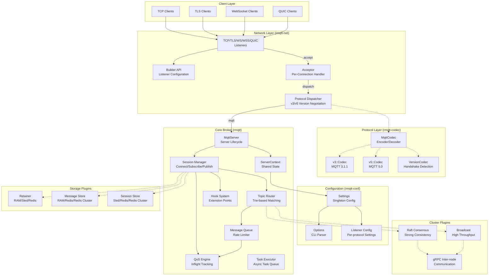
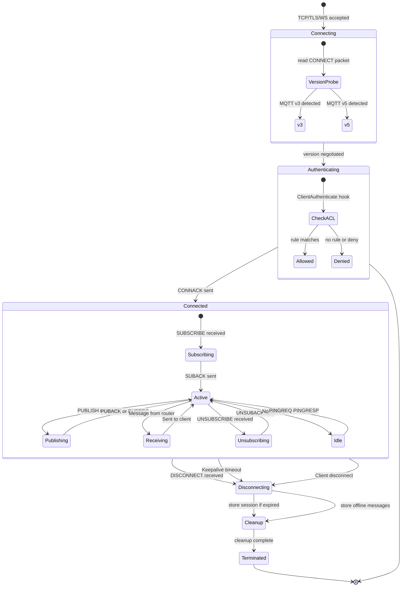
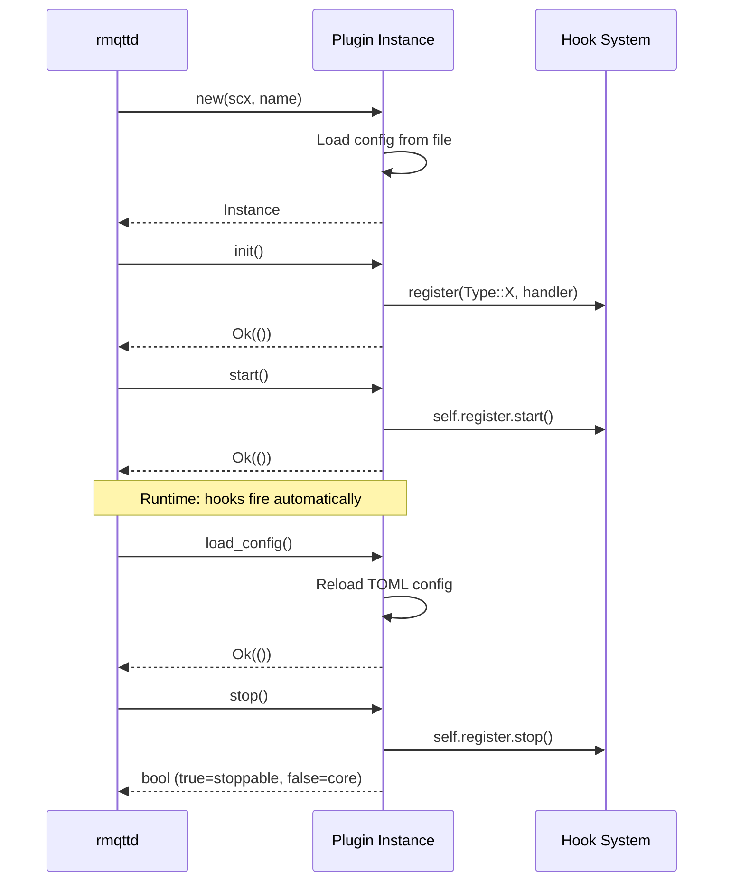
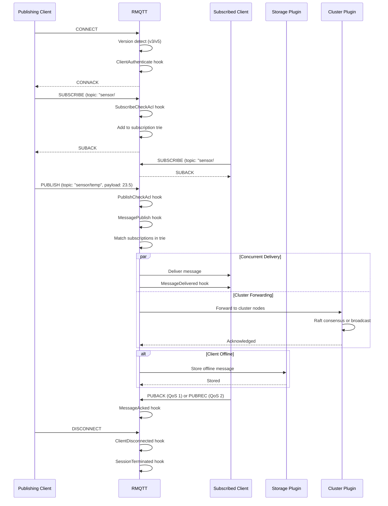
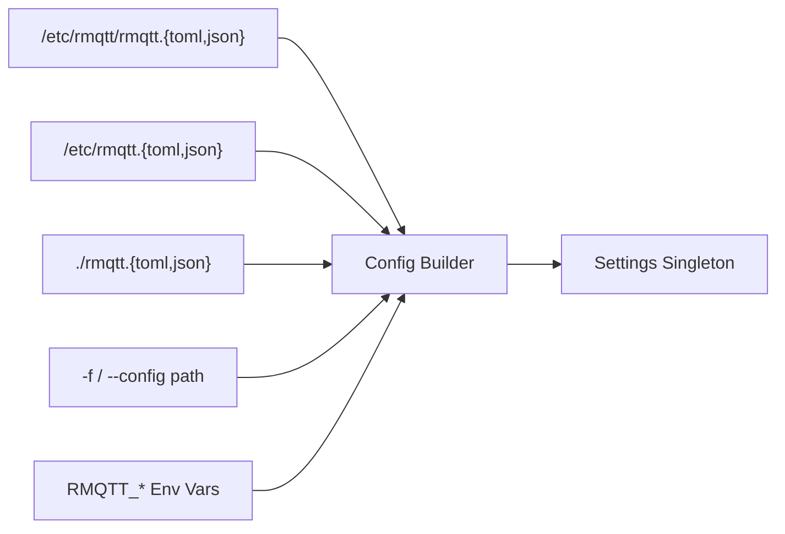

[**English**](overview.md) | [简体中文](../../zh_CN/architecture/overview.md)

# RMQTT Architecture Overview

This document describes the internal architecture of the RMQTT MQTT broker, its components, module organization, and key design decisions.

---

## System Architecture



---

## Crate Organization

The workspace is organized into these layers:

### Layer 1: Foundation Crates

These crates have no dependency on other workspace crates:

| Crate | Path | Responsibility |
|-------|------|----------------|
| `rmqtt-utils` | `rmqtt-utils/` | Shared types (`Bytesize`, `NodeAddr`, `Counter`), serde helpers, timestamp/duration parsing |
| `rmqtt-macros` | `rmqtt-macros/` | Procedural macros: `#[derive(Metrics)]` for atomic counters, `#[derive(Plugin)]` for `PackageInfo` trait |
| `rmqtt-codec` | `rmqtt-codec/` | MQTT protocol encoder/decoder — v3.1, v3.1.1, v5.0 with version negotiation |

### Layer 2: Infrastructure Crates

Build on foundation crates:

| Crate | Path | Dependencies | Responsibility |
|-------|------|--------------|----------------|
| `rmqtt-net` | `rmqtt-net/` | `rmqtt-codec`, `rmqtt-utils` | Network layer: TCP/TLS/WS/QUIC listeners, connection accept, protocol dispatch |
| `rmqtt-conf` | `rmqtt-conf/` | `rmqtt-codec`, `rmqtt-net`, `rmqtt-utils`, `config` crate | Configuration management: TOML parsing, CLI args, listener config |

### Layer 3: Core Broker

| Crate | Path | Dependencies | Responsibility |
|-------|------|--------------|----------------|
| `rmqtt` | `rmqtt/` | All above + `rmqtt-net`, `rmqtt-codec`, `rmqtt-utils`, `rmqtt-macros` (optional), `rust-box`, `dashmap`, `tokio` | Core MQTT broker: session management, routing, hooks, plugins, clustering |

### Layer 4: Binaries

| Crate | Path | Responsibility |
|-------|------|----------------|
| `rmqttd` | `rmqtt-bin/` | Production binary: CLI parsing → config → plugin registration → server start |
| `mqtt_harness` | `rmqtt-test/` | Test harness: functional, stress, and chaos testing |

### Layer 5: Plugins

| Crate | Path | Responsibility |
|-------|------|----------------|
| `rmqtt-plugins` | `rmqtt-plugins/` | Meta-crate re-exporting all plugins behind feature flags |
| `rmqtt-*` | `rmqtt-plugins/rmqtt-*/` | 25 individual plugin crates |

---

## Core Module Architecture (rmqtt/src/)

```
rmqtt/src/
├── lib.rs           # Crate root, re-exports, module declarations
│
├── server.rs        # MqttServer — builder + accept loop + lifecycle
├── context.rs       # ServerContext — shared state builder
├── session.rs       # Session — per-client state machine (~2400 lines)
│
├── v3.rs            # MQTT v3.1.1 protocol handler
├── v5.rs            # MQTT v5.0 protocol handler
│
├── router.rs        # Topic-based message router
├── trie.rs          # Trie structure for subscription matching
├── topic.rs         # Topic filter parsing and validation
├── fitter.rs        # Topic filter matching engine
│
├── inflight.rs      # In-flight message tracking (QoS 1/2)
├── queue.rs         # Message queue with rate limiting
│
├── hook.rs          # Hook system — 10+ extension points
├── extend.rs        # Extension point storage (10 RwLock slots)
├── executor.rs      # Async task executor wrapper
│
├── types.rs         # Core data types (~3000 lines)
├── node.rs          # Cluster node coordination, gRPC server
│
├── acl.rs           # ACL types and trait definitions
│
├── args.rs          # Command-line argument struct
├── shared.rs        # Shared subscriptions ($share/)
│
├── delayed.rs       # [feature: delayed] Delayed publish
├── grpc.rs          # [feature: grpc] gRPC communication
├── message.rs       # [feature: msgstore] Message storage
├── metrics.rs       # [feature: metrics] Metrics collection
├── plugin.rs        # [feature: plugin] Plugin trait + registration
├── retain.rs        # [feature: retain] Retained messages
├── stats.rs         # [feature: stats] Runtime statistics
└── subscribe.rs     # [feature: *-subscription] Subscription helpers
```

---

## Session Lifecycle



---

## Hook System

The hook system is the primary extension mechanism. It provides 10+ interception points along the message processing pipeline.

### Hook Trait

```rust
#[async_trait]
pub trait Handler: Send + Sync {
    async fn hook(&self, param: &Type, acc: Option<()>) -> ReturnType;
}
```

### Hook Types

| Hook Type | Trigger | Handler Returns |
|-----------|---------|-----------------|
| `BeforeStartup` | Broker initialization | Continue |
| `ClientConnect` | CONNECT received | `(bool, Option<ConnAckReason>)` |
| `ClientAuthenticate` | Before CONNACK | `(bool, Option<ConnAckReason>)` |
| `ClientConnack` | CONNACK sent | Continue |
| `ClientConnected` | Session established | Continue |
| `ClientDisconnected` | Session ended | Continue |
| `ClientSubscribe` | SUBSCRIBE received | Continue |
| `ClientSubscribeCheckAcl` | Subscribe ACL check | `(bool, Option<SubscribeAclResult>)` |
| `ClientUnsubscribe` | UNSUBSCRIBE received | Continue |
| `MessagePublish` | PUBLISH received | `(bool, Option<MessagePublishResult>)` |
| `MessagePublishCheckAcl` | Publish ACL check | `(bool, Option<PublishAclResult>)` |
| `MessageDelivered` | Message sent to client | Continue |
| `MessageAcked` | Client acknowledged | Continue |
| `MessageDropped` | Message dropped | Continue |
| `SessionCreated` | Session created | Continue |
| `SessionTerminated` | Session destroyed | Continue |
| `SessionSubscribed` | Subscription added | Continue |
| `SessionUnsubscribed` | Subscription removed | Continue |
| `OfflineMessage` | Offline message stored | Continue |
| `GrpcMessageReceived` | Cross-node gRPC message | `(bool, Option<Vec<u8>>)` |

### Hook Registration Priority

Handlers can register with a priority. Lower values execute first. The `counter` plugin registers at `Priority::MAX` to ensure it runs last.

---

## Plugin System

### Plugin Trait

```rust
#[async_trait]
pub trait Plugin: PackageInfo + Send + Sync {
    async fn init(&mut self) -> Result<()>;         // Register hooks
    async fn get_config(&self) -> Result<Value>;     // Current config
    async fn load_config(&mut self) -> Result<()>;   // Runtime reload
    async fn start(&mut self) -> Result<()>;          // Activate hooks
    async fn stop(&mut self) -> Result<bool>;         // Deactivate
    async fn attrs(&self) -> Value;                   // Runtime attributes
    async fn send(&self, msg: Value) -> Result<Value>;// Inter-plugin message
}
```

### Plugin Lifecycle



### Registration Pattern

Each plugin crate follows the same registration pattern via the `register!` macro:

```rust
// Generated by register!(MyPlugin::new)
pub async fn register_named(
    scx: &ServerContext,
    name: &'static str,
    default_startup: bool,
    immutable: bool,
) -> Result<()>;

pub async fn register(
    scx: &ServerContext,
    default_startup: bool,
    immutable: bool,
) -> Result<()>;
```

---

## Message Flow



---

## Configuration Loading Order



Plugin configs are loaded separately from `{plugins.dir}/{name}.toml` with `rmqtt_plugin_{name}_*` environment variables.

---

## Feature Flags

The core broker (`rmqtt`) uses Cargo feature flags to conditionally compile optional functionality:

| Feature | What it enables | Key Dependencies |
|---------|----------------|------------------|
| `default` | Minimal build (no extras) | — |
| `metrics` | Metrics collection | `rmqtt-macros/metrics` |
| `stats` | Runtime statistics | — |
| `plugin` | Plugin system | `rmqtt-macros/plugin` |
| `grpc` | Inter-node gRPC | `rust-box/handy-grpc`, `msgstore` |
| `tls` | TLS transport | `rmqtt-net/tls` |
| `ws` | WebSocket transport | `rmqtt-net/ws` |
| `quic` | QUIC transport | `rmqtt-net/quic` |
| `delayed` | Delayed publish | — |
| `retain` | Retained messages | — |
| `msgstore` | Message storage | — |
| `shared-subscription` | `$share/` groups | — |
| `auto-subscription` | Auto-subscribe on connect | — |
| `limit-subscription` | Subscription limits | — |
| `full` | All above | — |

---

## Key Design Decisions

### 1. Zero Unsafe Code

The entire codebase enforces `#![deny(unsafe_code)]`. All concurrency is handled through safe abstractions (`tokio::sync`, `DashMap`, `Arc`).

### 2. Lock Strategy

- **Hot paths**: `DashMap` (lock-free concurrent hash maps) for subscription trie and session lookups
- **Async contexts**: `tokio::sync::RwLock` for config and shared state (never `std::sync::RwLock` in async code)
- **Fine-grained**: `std::sync::Mutex` only for small, synchronous critical sections

### 3. No Panic in Production

- `unwrap()` / `expect()` only in test code
- All `Result` and `Option` are handled via `?` or pattern matching
- No `panic!` / `todo!` / `unreachable!` in production paths

### 4. Plugin Isolation

Each plugin is a separate crate with optional compilation. The meta-crate (`rmqtt-plugins`) re-exports all plugins behind feature flags, ensuring zero overhead for unused functionality.

### 5. Codec Architecture

The MQTT codec uses a state machine pattern:
1. `VersionCodec` detects protocol version from the CONNECT packet
2. Switches to `v3::Codec` or `v5::Codec` for the remainder of the session
3. Both implement `tokio_util::codec::Encoder/Decoder` for async streaming

---

## License

MIT OR Apache-2.0
