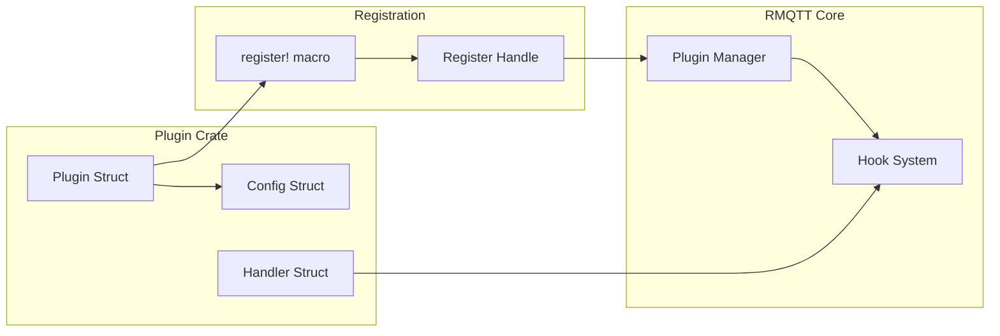
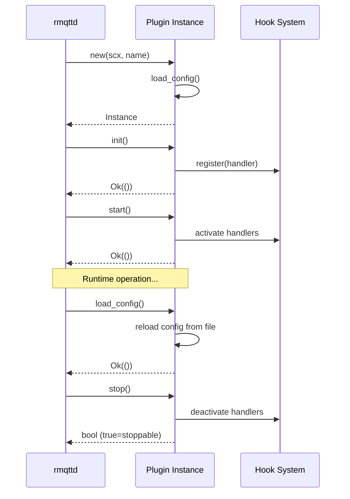

[**English**](plugin-development.md) | [简体中文](../../zh_CN/development/plugin-development.md)

# Plugin Development Guide

This guide explains how to develop plugins for RMQTT, covering the plugin lifecycle, hook system, configuration loading, and best practices.

---

## Plugin Architecture Overview

RMQTT plugins are independent Rust crates that implement the `Plugin` trait. They can intercept broker events through the hook system and extend broker functionality without modifying core code.



---

## Plugin Lifecycle



---

## Creating a Plugin

### Step 1: Create the Crate

```bash
# Create directory
mkdir rmqtt-plugins/rmqtt-my-plugin
cd rmqtt-plugins/rmqtt-my-plugin
```

### Step 2: Cargo.toml

```toml
[package]
name = "rmqtt-my-plugin"
version.workspace = true
description = "My custom RMQTT plugin"
edition.workspace = true
license.workspace = true

[dependencies]
rmqtt = { workspace = true, features = ["plugin"] }
serde = { workspace = true, features = ["derive"] }
tokio = { workspace = true, features = ["sync"] }
async-trait.workspace = true
log.workspace = true
serde_json.workspace = true
```

### Step 3: Plugin Structure (src/lib.rs)

```rust
use std::sync::Arc;
use tokio::sync::RwLock;
use rmqtt::context::ServerContext;
use rmqtt::plugin::{PackageInfo, Plugin, Register};
use rmqtt::hook::{self, Type, ReturnType, Handler};
use serde::Deserialize;

// --- Plugin Struct ---

pub struct MyPlugin {
    scx: ServerContext,
    register: Box<dyn Register>,
    cfg: Arc<RwLock<PluginConfig>>,
}

// The register! macro generates register_named() and register() functions
register!(MyPlugin::new);

impl MyPlugin {
    pub async fn new<S: Into<String>>(scx: ServerContext, name: S) -> rmqtt::Result<Self> {
        // Load configuration
        let cfg: PluginConfig = scx.plugins.load_config_default(name.into().as_str())?;
        let cfg = Arc::new(RwLock::new(cfg));

        // Get register handle
        let register = scx.plugins.register(name).await?;

        Ok(Self { scx, register, cfg })
    }
}

// --- Configuration ---

#[derive(Debug, Clone, Deserialize)]
#[serde(default)]
pub struct PluginConfig {
    pub setting_one: String,
    pub setting_two: u32,
    pub enable_feature: bool,
}

impl Default for PluginConfig {
    fn default() -> Self {
        Self {
            setting_one: "default_value".into(),
            setting_two: 42,
            enable_feature: true,
        }
    }
}

// --- Handler ---

struct MyHandler {
    cfg: Arc<RwLock<PluginConfig>>,
}

#[async_trait]
impl Handler for MyHandler {
    async fn hook(&self, param: &Type, acc: Option<()>) -> ReturnType {
        match param {
            Type::MessagePublish => {
                // Handle publish event
                log::info!("Message published");
                (true, None) // (continue, no result modification)
            }
            Type::ClientConnected => {
                log::info!("Client connected");
                (true, None)
            }
            _ => (true, None),
        }
    }
}

// --- Plugin Implementation ---

#[async_trait]
impl Plugin for MyPlugin {
    async fn init(&mut self) -> rmqtt::Result<()> {
        // Register handlers with hook system
        self.register.add(Type::MessagePublish, MyHandler {
            cfg: self.cfg.clone(),
        }).await;

        self.register.add(Type::ClientConnected, MyHandler {
            cfg: self.cfg.clone(),
        }).await;

        Ok(())
    }

    async fn start(&mut self) -> rmqtt::Result<()> {
        // Activate registered handlers
        self.register.start().await
    }

    async fn stop(&mut self) -> Result<bool, Box<dyn std::error::Error>> {
        // Deactivate; return true if stoppable
        self.register.stop().await
    }

    async fn get_config(&self) -> rmqtt::Result<serde_json::Value> {
        let cfg = self.cfg.read().await;
        Ok(serde_json::to_value(&*cfg)?)
    }

    async fn load_config(&mut self) -> rmqtt::Result<()> {
        let cfg: PluginConfig = self.scx.plugins.load_config_default("rmqtt-my-plugin")?;
        *self.cfg.write().await = cfg;
        Ok(())
    }

    async fn attrs(&self) -> serde_json::Value {
        serde_json::json!({
            "name": "my-plugin",
            "version": env!("CARGO_PKG_VERSION"),
        })
    }

    async fn send(&self, _msg: serde_json::Value) -> rmqtt::Result<serde_json::Value> {
        Err(anyhow::anyhow!("not implemented"))
    }
}
```

### Step 4: Plugin Configuration (rmqtt-my-plugin.toml)

```toml
# rmqtt-plugins/rmqtt-my-plugin.toml
setting_one = "custom_value"
setting_two = 100
enable_feature = true
```

---

## Registering the Plugin

### Add to rmqtt-plugins meta-crate

In `rmqtt-plugins/Cargo.toml`:

```toml
[dependencies]
rmqtt-my-plugin = { path = "rmqtt-my-plugin", optional = true }

[features]
my-plugin = ["rmqtt-my-plugin"]
```

In `rmqtt-plugins/src/lib.rs`:

```rust
#[cfg(feature = "my-plugin")]
pub use rmqtt_my_plugin as my_plugin;
```

### Add to rmqttd binary

In `rmqtt-bin/Cargo.toml`:

```toml
rmqtt-my-plugin = "0.1"
```

Add to `[package.metadata.plugins]` in `rmqtt-bin/Cargo.toml` for auto-registration:

```toml
[package.metadata.plugins]
rmqtt-my-plugin = { default_startup = true }
```

### Alternative: Manual Registration

```rust
rmqtt_my_plugin::register(&scx, true, false).await?;
```

Parameters: `(scx, default_startup, immutable)`.

---

## Hook Reference

All available hook types:

| Hook Type | Trigger Condition | Handler Returns |
|-----------|-----------------|-----------------|
| `BeforeStartup` | Broker initialization | — |
| `ClientConnect` | CONNECT received | `(bool, Option<ConnAckReason>)` |
| `ClientAuthenticate` | Before CONNACK | `(bool, Option<ConnAckReason>)` |
| `ClientConnack` | CONNACK sent | — |
| `ClientConnected` | Session established | — |
| `ClientDisconnected` | Session ended | — |
| `ClientSubscribe` | SUBSCRIBE received | — |
| `ClientSubscribeCheckAcl` | Subscribe ACL check | `(bool, Option<SubscribeAclResult>)` |
| `ClientUnsubscribe` | UNSUBSCRIBE received | — |
| `MessagePublish` | PUBLISH received | `(bool, Option<MessagePublishResult>)` |
| `MessagePublishCheckAcl` | Publish ACL check | `(bool, Option<PublishAclResult>)` |
| `MessageDelivered` | Message sent to client | — |
| `MessageAcked` | Client acknowledged | — |
| `MessageDropped` | Message dropped | — |
| `SessionCreated` | Session created | — |
| `SessionTerminated` | Session destroyed | — |
| `SessionSubscribed` | Subscription added | — |
| `SessionUnsubscribed` | Subscription removed | — |
| `OfflineMessage` | Offline message stored | — |
| `GrpcMessageReceived` | Cross-node gRPC | `(bool, Option<Vec<u8>>)` |

### Handler Priority

```rust
// Register with specific priority (lower = earlier execution)
register.add_priority(Type::MessagePublish, handler, 100).await
```

The `counter` plugin uses `Priority::MAX` to ensure it runs last.

---

## Configuration Loading

Plugins load configuration via the `Plugins` API:

```rust
// Config file required, returns error if missing
let cfg: MyConfig = scx.plugins.load_config("my-plugin")?;

// Config file optional, uses Default if missing
let cfg: MyConfig = scx.plugins.load_config_default("my-plugin")?;

// With environment variable list keys
let cfg: MyConfig = scx.plugins.load_config_with("my-plugin", &["my_list_key"])?;

// Optional file + env list keys
let cfg: MyConfig = scx.plugins.load_config_default_with("my-plugin", &["my_list_key"])?;
```

Configuration sources (in priority order):
1. `{plugins.dir}/{name}.toml`
2. `rmqtt_plugin_{name}_*` environment variables
3. Inline config via `ServerContext::plugins_config_map_add()`

---

## Best Practices

### 1. Handler Pass-Through

Unless your plugin needs to modify the result, always return `(true, None)` from handlers:

```rust
async fn hook(&self, _param: &Type, _acc: Option<()>) -> ReturnType {
    (true, None)  // continue processing, no modification
}
```

### 2. Configuration Defaults

Always implement `Default` for your config struct and use `load_config_default`:

```rust
#[derive(Deserialize)]
#[serde(default)]  // use Default::default() for missing fields
struct MyConfig { ... }

impl Default for MyConfig { ... }
```

### 3. Thread Safety

The plugin struct must be `Send + Sync`. Use `Arc<RwLock<T>>` for shared mutable state:

```rust
pub struct MyPlugin {
    cfg: Arc<RwLock<PluginConfig>>,
    counter: Arc<AtomicUsize>,
}
```

### 4. Hook Registration

Register hooks in `init()`, not in `new()`. The hook system is not ready during construction.

```rust
async fn init(&mut self) -> Result<()> {
    self.register.add(Type::X, handler).await;
    Ok(())
}
```

### 5. Storage Plugin Pattern

If your plugin provides storage, inject it into `scx.extends` during `start()`:

```rust
async fn start(&mut self) -> Result<()> {
    *self.scx.extends.retain_mut() = Some(Box::new(my_storage));
    self.register.start().await
}
```

### 6. Stop Behavior

- Return `true` if the plugin can be stopped and restarted at runtime
- Return `false` for core plugins that must remain active (ACL, retainer, cluster)

---

## Existing Plugin Examples

| Plugin | Lines | Key Pattern |
|--------|-------|-------------|
| `rmqtt-counter` | ~80 | Simplest plugin, no config, 15 hook handlers, `Priority::MAX` |
| `rmqtt-acl` | ~300 | ACL with `ClientSubscribeCheckAcl` + `MessagePublishCheckAcl` |
| `rmqtt-retainer` | ~200 | Storage injection via `scx.extends`, background cleanup task |
| `rmqtt-web-hook` | ~400 | Async producer-consumer with mpsc channel, exponential backoff |
| `rmqtt-cluster-raft` | ~500+ | Dedicated OS thread with independent Tokio runtime |

---

## License

MIT OR Apache-2.0
