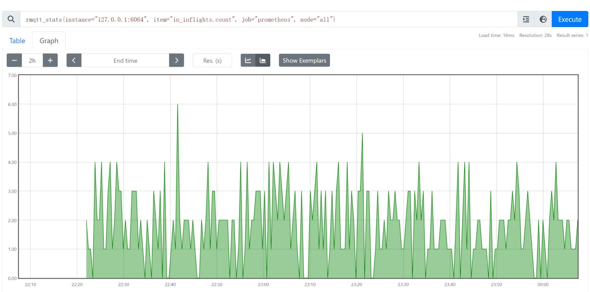

English | [简体中文](../zh_CN/http-api.md)

# HTTP API

RMQTT Broker provides HTTP APIs for integration with external systems,such as querying client information, publishing
messages.

RMQTT Broker's HTTP API service listens on port 6060 by default. You can modify the listening port through the
configuration file of etc/plugins/rmqtt-http-api.toml. All API calls start with api/v1.

#### Plugins:

```bash
rmqtt-http-api
```

#### Plugin configuration file:

```bash
plugins/rmqtt-http-api.toml
```

#### Plugin configuration options:

```bash
##--------------------------------------------------------------------
## rmqtt-http-api
##--------------------------------------------------------------------

# See more keys and their definitions at https://github.com/rmqtt/rmqtt/blob/master/docs/en_US/http-api.md

##Number of worker threads
workers = 1
## Max Row Limit
max_row_limit = 10_000
## HTTP Listener
http_laddr = "0.0.0.0:6060"
## Indicates whether to print HTTP request logs
http_request_log = false
## If set, will check request header Authorization value == Bearer $http_bearer_token, default value is undefined
#http_bearer_token = bearer_token

##Whether support retain message, true/false, default value: true
message_retain_available = true
##Message expiration time, 0 means no expiration
message_expiry_interval = "5m"
```

## Response code

### HTTP status codes

The RMQTT Broker interface always returns 200 OK when the call is successful, and the response content is returned in
JSON format.

The possible status codes are as follows:

| Status Code | Description |
| ---- | ----------------------- |
| 200  | Succeed, and the returned JSON data will provide more information |
| 400  | Invalid client request, such as wrong request body or parameters |
| 401  | Client authentication failed , maybe because of invalid authentication credentials |
| 404  | The requested path cannot be found or the requested object does not exist |
| 500  | An internal error occurred while the server was processing the request |

## API Endpoints

## /api/v1

### GET /api/v1

Return all Endpoints supported by RMQTT Broker.

**Parameters:** None

**Success Response Body (JSON):**

| Name             | Type |  Description   |
|------------------| --------- | -------------- |
| []             | Array     | Endpoints list |
| - [0].path   | String    | Endpoint       |
| - [0].name   | String    | Endpoint name    |
| - [0].method | String    | HTTP Method    |
| - [0].descr  | String    | Description      |

**Examples:**

```bash
$ curl -i -X GET "http://localhost:6060/api/v1"

[{"descr":"Return the basic information of all nodes in the cluster","method":"GET","name":"get_brokers","path":"/brokers/{node}"}, ...]

```

## Broker Basic Information

### GET /api/v1/brokers/{node}

Return basic information of all nodes in the cluster.

**Path Parameters:**

| Name | Type | Required | Description                                                                  |
| ---- | --------- | ------------|------------------------------------------------------------------------------|
| node | Integer    | False       | Node ID，such as 1. <br/>If not specified, returns all node basic information |

**Success Response Body (JSON):**

| Name           | Type | Description                                                                                                              |
|----------------| --------- |--------------------------------------------------------------------------------------------------------------------------|
| {}/[]          | Object/Array of Objects | Returns the information of the specified node when the parameter exists, <br/>otherwise, returns the information of all nodes |
| .datetime      | String    | Current time, in the format of "YYYY-MM-DD HH:mm:ss"                        |
| .node_id       | Integer    | Node ID                                                                      |
| .node_name     | String    | Node name                                                                        |
| .running       | Bool    | Node is healthy                                                  |
| .sysdescr      | String    | Software description                                                               |
| .uptime        | String    | RMQTT Broker runtime, in the format of "D days, H hours, m minutes, s seconds"     |
| .version       | String    | RMQTT Broker version                                                 |
| .rustc_version | String    | RUSTC version                                         |

**Examples:**

Get the basic information of all nodes:

```bash
$ curl -i -X GET "http://localhost:6060/api/v1/brokers"

[{"datetime":"2022-07-24 23:01:31","node_id":1,"node_name":"1@127.0.0.1","node_status":"Running","sysdescr":"RMQTT Broker","uptime":"5 days 23 hours, 16 minutes, 3 seconds","version":"rmqtt/0.2.3-20220724094535"}]
```

Get the basic information of node 1 :

```bash
$ curl -i -X GET "http://localhost:6060/api/v1/brokers/1"

{"datetime":"2022-07-24 23:01:31","node_id":1,"node_name":"1@127.0.0.1","node_status":"Running","sysdescr":"RMQTT Broker","uptime":"5 days 23 hours, 17 minutes, 15 seconds","version":"rmqtt/0.2.3-20220724094535"}
```

## Node

### GET /api/v1/nodes/{node}

Return the status of the node.

**Path Parameters:**

| Name | Type | Required | Description                                                             |
| ---- | --------- | ------------|-------------------------------------------------------------------------|
| node | Integer    | False       | Node ID, such as 1. <br/>If not specified, returns all node information |

**Success Response Body (JSON):**

| Name           | Type                    | Description                                                                                                         |
|----------------|-------------------------|---------------------------------------------------------------------------------------------------------------------|
| {}/[]          | Object/Array of Objects | Returns node information when node parameter exists,<br/>otherwise, returns information about all nodes in an Array |
| .boottime      | String                  | OS startup time                                                                                                     |
| .connections   | Integer                 | Number of clients currently connected to this node                                                                  |
| .disk_free     | Integer                 | Disk usable capacity (bytes)                                                                                        |
| .disk_total    | Integer                 | Total disk capacity (bytes)                                                                                         |
| .load1         | Float                   | CPU average load in 1 minute                                                                                        |
| .load5         | Float                   | CPU average load in 5 minute                                                                                        |
| .load15        | Float                   | CPU average load in 15 minute                                                                                       |
| .memory_free   | Integer                 | System free memory size (bytes)                                                                                     |
| .memory_total  | Integer                 | Total system memory size (bytes)                                                                                    |
| .memory_used   | Integer                 | Used system memory size (bytes)                                                                                     |
| .node_id       | Integer                 | Node ID                                                                                                             |
| .node_name     | String                  | Node name                                                                                                           |
| .running       | Bool                    | Node is healthy                                                                                                   |
| .uptime        | String                  | RMQTT Broker runtime, in the format of "D days, H hours, m minutes, s seconds"                                                                                                          |
| .version       | String                  | RMQTT Broker version                                                                                                            |
| .rustc_version | String                  | RUSTC version                                         |

**Examples:**

Get the status of all nodes:

```bash
$ curl -i -X GET "http://localhost:6060/api/v1/nodes"

[{"boottime":"2022-06-30 05:20:24 UTC","connections":1,"disk_free":77382381568,"disk_total":88692346880,"load1":0.0224609375,"load15":0.0,"load5":0.0263671875,"memory_free":1457954816,"memory_total":2084057088,"memory_used":626102272,"node_id":1,"node_name":"1@127.0.0.1","node_status":"Running","uptime":"5 days 23 hours, 33 minutes, 0 seconds","version":"rmqtt/0.2.3-20220724094535"}]
```

Get the status of the specified node:

```bash
$ curl -i -X GET "http://localhost:6060/api/v1/nodes/1"

{"boottime":"2022-06-30 05:20:24 UTC","connections":1,"disk_free":77382381568,"disk_total":88692346880,"load1":0.0224609375,"load15":0.0,"load5":0.0263671875,"memory_free":1457954816,"memory_total":2084057088,"memory_used":626102272,"node_id":1,"node_name":"1@127.0.0.1","node_status":"Running","uptime":"5 days 23 hours, 33 minutes, 0 seconds","version":"rmqtt/0.2.3-20220724094535"}
```

## Client

### GET /api/v1/clients

<span id = "get-clients" />

Returns the information of all clients under the cluster.

**Query String Parameters:**

| Name   | Type | Required | Default | Description                                                                                                                                                             |
| ------ | --------- | -------- | ------- |-------------------------------------------------------------------------------------------------------------------------------------------------------------------------|
| _limit | Integer   | False | 10000   | The maximum number of data items returned at one time. If not specified, it is determined by the configuration item `max_row_limit` of the` rmqtt-http-api.toml` plugin |

| Name            | Type   | Required | Description                     |
| --------------- | ------ | -------- |---------------------------------|
| clientid        | String | False    | Client identifier                    |
| username        | String | False    | Client username                         |
| ip_address      | String | False    | Client IP address                      |
| connected       | Bool   | False    | The current connection status of the client     |
| clean_start     | Bool   | False    | Whether the client uses a new session            |
| session_present | Bool   | False    | Whether the client is connected to an existing session    |
| proto_ver       | Integer| False    | Client protocol version             |
| _like_clientid  | String | False    | Fuzzy search of client identifier by substring method                  |
| _like_username  | String | False    | Client user name, fuzzy search by substring                 |
| _gte_created_at | Integer| False    | Search client session creation time by greater than or equal method      |
| _lte_created_at | Integer| False    | Search client session creation time by less than or equal method          |
| _gte_connected_at | Integer| False    | Search client connection creation time by greater than or equal method    |
| _lte_connected_at | Integer| False    | Search client connection creation time by less than or equal method  |
| _gte_mqueue_len | Integer| False    | Current length of message queue by greater than or equal method  |
| _lte_mqueue_len | Integer| False    | Current length of message queue by less than or equal method |

**Success Response Body (JSON):**

| Name                    | Type             | Description                                                                                                                       |
|-------------------------|------------------|-----------------------------------------------------------------------------------------------------------------------------------|
| []                      | Array of Objects | Information for all clients                                                                                                       |
| [0].node_id             | Integer          | ID of the node to which the client is connected                                                                                   |
| [0].clientid            | String           | Client identifier                                                                                                                 |
| [0].username            | String           | User name of client when connecting                                                                                               |
| [0].proto_ver           | Integer          | Protocol version used by the client                                                                                               |
| [0].ip_address          | String           | Client's IP address                                                                                                               |
| [0].port                | Integer          | Client port                                                                                                                       | 
| [0].connected_at        | String           | Client connection time, in the format of "YYYY-MM-DD HH:mm:ss"                                                                    |
| [0].disconnected_at     | String           | Client offline time, in the formatof "YYYY-MM-DD HH:mm:ss"，<br/>This field is only valid and returned when `connected` is` false` |
| [0].disconnected_reason | String           | Client offline reason                                                                                                             |
| [0].connected           | Boolean          | Whether the client is connected                                                                                                   |
| [0].keepalive           | Integer          | keepalive time, with the unit of second                                                                                           |
| [0].clean_start         | Boolean          | Indicate whether the client is using a brand new session                                                                          |
| [0].expiry_interval     | Integer          | Session expiration interval, with the unit of second                                                                              |
| [0].created_at          | String           | Session creation time, in the format "YYYY-MM-DD HH:mm:ss"                                                                        |
| [0].subscriptions_cnt   | Integer          | Number of subscriptions established by this client                                                                                |
| [0].max_subscriptions   | Integer          | Maximum number of subscriptions allowed by this client                                                                            |
| [0].inflight            | Integer          | Current length of inflight                                                                                                        |
| [0].max_inflight        | Integer          | Maximum length of inflight                                                                                                        |
| [0].mqueue_len          | Integer          | Current length of message queue                                                                                                   |
| [0].max_mqueue          | Integer          | Maximum length of message queue                                                                                                   |
| [0].extra_attrs         | Integer          | Number of Extended Attributes                                                                                                     |
| [0].last_will           | Json             | Last Will Message, for example: { "message": "dGVzdCAvdGVzdC9sd3QgLi4u", "qos": 1, "retain": false, "topic": "/test/lwt" }        |

**Examples:**

```bash
$ curl -i -X GET "http://localhost:6060/api/v1/clients?_limit=10"

[{"clean_start":true,"clientid":"be82ee31-7220-4cad-a724-aaad9a065012","connected":true,"connected_at":"2022-07-30 18:14:08","created_at":"2022-07-30 18:14:08","disconnected_at":"","expiry_interval":7200,"inflight":0,"ip_address":"183.193.169.110","keepalive":60,"max_inflight":16,"max_mqueue":1000,"max_subscriptions":0,"mqueue_len":0,"node_id":1,"port":10839,"proto_ver":4,"subscriptions_cnt":0,"username":"undefined"}]
```

### GET /api/v1/clients/{clientid}

Returns information for the specified client

**Path Parameters:**

| Name   | Type | Required | Description |
| ------ | --------- | -------- |  ---- |
| clientid  | String | True | ClientID |

**Success Response Body (JSON):**

| Name | Type | Description |
|------| --------- | ----------- |
| {}   | Array of Objects | Client information, for details, see<br/>[GET /api/v1/clients](#get-clients)|

**Examples:**

Query the specified client

```bash
$ curl -i -X GET "http://localhost:6060/api/v1/clients/example1"

{"clean_start":true,"clientid":"example1","connected":true,"connected_at":"2022-07-30 23:30:43","created_at":"2022-07-30 23:30:43","disconnected_at":"","expiry_interval":7200,"inflight":0,"ip_address":"183.193.169.110","keepalive":60,"max_inflight":16,"max_mqueue":1000,"max_subscriptions":0,"mqueue_len":0,"node_id":1,"port":11232,"proto_ver":4,"subscriptions_cnt":0,"username":"undefined"}
```

### DELETE /api/v1/clients/{clientid}

Kick out the specified client. Note that this operation will terminate the connection with the session.

**Path Parameters:**

| Name   | Type | Required | Description |
| ------ | --------- | -------- |  ---- |
| clientid  | String | True | ClientID |

**Success Response Body (String):**

| Name       | Type             | Description |
|------------|------------------|-----------|
| id         | String          | Connection Unique ID  |

**Examples:**

Kick out the specified client

```bash
$ curl -i -X DELETE "http://localhost:6060/api/v1/clients/example1"

1@10.0.4.6:1883/183.193.169.110:10876/example1/dashboard
```

### GET /api/v1/clients/{clientid}/online

Check if the client is online

**Path Parameters:**

| Name   | Type | Required | Description |
| ------ | --------- | -------- |  ---- |
| clientid  | String | True | ClientID |

**Success Response Body (JSON):**

| Name | Type | Description |
|------|------|-------------|
| body | Bool | is online   |

**Examples:**

Check if the client is online

```bash
$ curl -i -X GET "http://localhost:6060/api/v1/clients/example1/online"

false
```

## Subscription Information

### GET /api/v1/subscriptions

Returns all subscription information under the cluster.

**Query String Parameters:**

| Name   | Type | Required | Default | Description                                                                                                  |
| ------ | --------- | -------- | ------- |--------------------------------------------------------------------------------------------------------------|
| _limit | Integer   | False | 10000   | The maximum number of data items returned at one time, if not specified, it is determined by the configuration item `max_row_limit` of the `rmqtt-http-api.toml` plugin |

| Name         | Type    | Description |
| ------------ | ------- | ----------- |
| clientid     | String  | Client identifier    |
| topic        | String  | congruent query  |
| qos          | Enum    | Possible values are `0`,`1`,`2` |
| share        | String  | Shared subscription group name |
| _match_topic | String  | Match query |

**Success Response Body (JSON):**

| Name            | Type             | Description |
|-----------------|------------------|-------------|
| []              | Array of Objects | All subscription information      |
| [0].node_id     | Integer          | Node ID     |
| [0].clientid    | String           | Client identifier      |
| [0].client_addr | String           | Client IP address and port  |
| [0].topic       | String           | Subscribe to topic        |
| [0].qos         | Integer          | QoS level      |
| [0].share       | String           | Shared subscription group name    |

**Examples:**

```bash
$ curl -i -X GET "http://localhost:6060/api/v1/subscriptions?_limit=10"

[{"node_id":1,"clientid":"example1","topic":"foo/#","qos":2,"share":null},{"node_id":1,"clientid":"example1","topic":"foo/+","qos":2,"share":"test"}]
```

### GET /api/v1/subscriptions/{clientid}

Return the subscription information of the specified client in the cluster.

**Path Parameters:**

| Name   | Type | Required | Description |
| ------ | --------- | -------- |  ---- |
| clientid  | String | True | ClientID |

**Success Response Body (JSON):**

| Name            | Type             | Description |
|-----------------|------------------|-------------|
| []              | Array of Objects | All subscription information      |
| [0].node_id     | Integer          | Node ID     |
| [0].clientid    | String           | Client identifier      |
| [0].client_addr | String           | Client IP address and port  |
| [0].topic       | String           | Subscribe to topic        |
| [0].qos         | Integer          | QoS level      |
| [0].share       | String           | Shared subscription group name    |

**Examples:**

```bash
$ curl -i -X GET "http://localhost:6060/api/v1/subscriptions/example1"

[{"node_id":1,"clientid":"example1","topic":"foo/+","qos":2,"share":"test"},{"node_id":1,"clientid":"example1","topic":"foo/#","qos":2,"share":null}]
```

## Routes

### GET /api/v1/routes

List all routes

**Query String Parameters:**

| Name   | Type | Required | Default | Description |
| ------ | --------- | -------- | ------- |  ---- |
| _limit | Integer   | False | 10000   | The maximum number of data items returned at one time, if not specified, it is determined by the configuration item `max_row_limit` of the `rmqtt-http-api.toml` plugin |

**Success Response Body (JSON):**

| Name          | Type | Description |
|---------------| --------- |-------------|
| []            | Array of Objects | All routes information      |
| [0].topic | String    | MQTT Topic  |
| [0].node_id  | Integer    | Node ID     |

**Examples:**

```bash
$ curl -i -X GET "http://localhost:6060/api/v1/routes"

[{"node_id":1,"topic":"foo/#"},{"node_id":1,"topic":"foo/+"}]
```

### GET /api/v1/routes/{topic}

List all routes of a topic.

**Path Parameters:**

| Name   | Type | Required | Description |
| ------ | --------- | -------- |-------------|
| topic  | String   | True | Topic       |

**Success Response Body (JSON):**

| Name      | Type | Description            |
|-----------| --------- |------------------------|
| []        | Array of Objects | All routes information |
| [0].topic | String    | MQTT Topic             |
| [0].node_id | Integer    | Node ID                |

**Examples:**

```bash
$ curl -i -X GET "http://localhost:6060/api/v1/routes/foo%2f1"

[{"node_id":1,"topic":"foo/#"},{"node_id":1,"topic":"foo/+"}]
```

## Publish message

### POST /api/v1/mqtt/publish

Publish MQTT message。

**Parameters (json):**

| Name     | Type | Required | Default | Description                             |
| -------- | --------- | -------- |--------|-----------------------------------------|
| topic    | String    | Optional |        | For topic and topics, with at least one of them specified                  |
| topics   | String    | Optional |        | Multiple topics separated by `,`. This field is used to publish messages to multiple topics at the same time       |
| clientid | String    | Optional | system | Client identifier                            |
| payload  | String    | Required |        | Message body                                    |
| encoding | String    | Optional | plain  | The encoding used in the message body. Currently only plain and base64 are supported |
| qos      | Integer   | Optional | 0      | QoS level                                  |
| retain   | Boolean   | Optional | false  | Whether it is a retained message                                 |

**Success Response Body (JSON):**

| Name | Type   | Description |
|------|--------|-------------|
| body | String | ok          |

**Examples:**

```bash
$ curl -i -X POST "http://localhost:6060/api/v1/mqtt/publish" --header 'Content-Type: application/json' -d '{"topic":"foo/1","payload":"Hello World","qos":1,"retain":false,"clientid":"example"}'

ok

$ curl -i -X POST "http://localhost:6060/api/v1/mqtt/publish" --header 'Content-Type: application/json' -d '{"topic":"foo/1","payload":"SGVsbG8gV29ybGQ=","qos":1,"encoding":"base64"}'

ok
```

## Subscribe to topic

### POST /api/v1/mqtt/subscribe

Subscribe to MQTT topic

**Parameters (json):**

| Name     | Type | Required | Default | Description |
| -------- | --------- | -------- | ------- | ------------ |
| topic    | String    | Optional |         | For topic and topics, with at least one of them specified |
| topics   | String    | Optional |         | Multiple topics separated by `,`. This field is used to subscribe to multiple topics at the same time |
| clientid | String    | Required |         | Client identifier |
| qos      | Integer   | Optional | 0       | QoS level |

**Success Response Body (JSON):**

| Name    | Type   | Description                                                        |
|---------|--------|--------------------------------------------------------------------|
| {}      | Object |                                                                    |
| {topic} | Bool   | Key is topic name，The value is the subscription result: true/false |

**Examples:**

Subscribe to the three topics `foo/a`, `foo/b`, `foo/c`

```bash
$ curl -i -X POST "http://localhost:6060/api/v1/mqtt/subscribe" --header 'Content-Type: application/json' -d '{"topics":"foo/a,foo/b,foo/c","qos":1,"clientid":"example1"}'

{"foo/a":true,"foo/c":true,"foo/b":true}
```

### POST /api/v1/mqtt/unsubscribe

Unsubscribe.

**Parameters (json):**

| Name     | Type | Required | Default | Description |
| -------- | --------- | -------- | ------- |-------------|
| topic    | String    | Required |         | Topic       |
| clientid | String    | Required |         | Client identifier      |

**Success Response Body (JSON):**

| Name | Type | Description |
|------|------|-------------|
| body | Bool | true/false  |

**Examples:**

Unsubscribe from `foo/a` topic

```bash
$ curl -i -X POST "http://localhost:6060/api/v1/mqtt/unsubscribe" --header 'Content-Type: application/json' -d '{"topic":"foo/a","clientid":"example1"}'

true
```

## plugins

### GET /api/v1/plugins

Returns information of all plugins in the cluster.

**Path Parameters:** 无

**Success Response Body (JSON):**

| Name                  | Type             | Description                                                                                                         |
|-----------------------|------------------|---------------------------------------------------------------------------------------------------------------------|
| []                    | Array of Objects | All plugin information                                                                                              |
| [0].node              | Integer          | Node ID                                                                                                             |
| [0].plugins           | Array            | Plugin information, an array of objects, see below                                                                  |
| [0].plugins.name      | String           | Plugin name                                                                                                         |
| [0].plugins.version   | String           | Plugin version                                                                                                      |
| [0].plugins.descr     | String           | Plugin description                                                                                                  |
| [0].plugins.active    | Boolean          | Whether the plugin is active                                                                                        |
| [0].plugins.inited    | Boolean          | Whether the plugin is initialized                                                                                   |
| [0].plugins.immutable | Boolean          | Whether the plugin is immutable, Immutable plugins will not be able to be stopped, config modified, restarted, etc. |
| [0].plugins.attrs     | Json             | Other additional properties of the plugin              |

**Examples:**

```bash
$ curl -i -X GET "http://localhost:6060/api/v1/plugins"

[{"node":1,"plugins":[{"active":false,"attrs":null,"descr":null,"immutable":true,"inited":false,"name":"rmqtt-cluster-raft","version":null},{"active":false,"attrs":null,"descr":null,"immutable":false,"inited":false,"name":"rmqtt-auth-http","version":null},{"active":true,"attrs":null,"descr":"","immutable":true,"inited":true,"name":"rmqtt-acl","version":"0.1.1"},{"active":true,"attrs":null,"descr":"","immutable":false,"inited":true,"name":"rmqtt-counter","version":"0.1.0"},{"active":true,"attrs":null,"descr":"","immutable":false,"inited":true,"name":"rmqtt-http-api","version":"0.1.1"},{"active":false,"attrs":null,"descr":null,"immutable":false,"inited":false,"name":"rmqtt-web-hook","version":null},{"active":false,"attrs":null,"descr":null,"immutable":true,"inited":false,"name":"rmqtt-cluster-broadcast","version":null}]}]
```

### GET /api/v1/plugins/{node}

Return the plugin information under the specified node

**Path Parameters:**

| Name | Type | Required | Description         |
| ---- | --------- |----------|---------------------|
| node | Integer    | True     | Node ID, Such as: 1 |

**Success Response Body (JSON):**

| Name           | Type             | Description                    |
|----------------|------------------|--------------------------------|
| []             | Array of Objects | Plugin information, an array of objects, see below   |
| [0].name       | String           | Plugin name                       |
| [0].version    | String           | Plugin version                      |
| [0].descr      | String           | Plugin description                  |
| [0].active     | Boolean          | Whether the plugin is active                        |
| [0].inited     | Boolean          | Whether the plugin is initialized                 |
| [0].immutable  | Boolean          | Whether the plugin is immutable, Immutable plugins will not be able to be stopped, config modified, restarted, etc. |
| [0].attrs      | Json             | Other additional properties of the plugin       |

**Examples:**

```bash
$ curl -i -X GET "http://localhost:6060/api/v1/plugins/1"

[{"active":false,"attrs":null,"descr":null,"immutable":true,"inited":false,"name":"rmqtt-cluster-raft","version":null},{"active":false,"attrs":null,"descr":null,"immutable":false,"inited":false,"name":"rmqtt-auth-http","version":null},{"active":true,"attrs":null,"descr":"","immutable":true,"inited":true,"name":"rmqtt-acl","version":"0.1.1"},{"active":true,"attrs":null,"descr":"","immutable":false,"inited":true,"name":"rmqtt-counter","version":"0.1.0"},{"active":true,"attrs":null,"descr":"","immutable":false,"inited":true,"name":"rmqtt-http-api","version":"0.1.1"},{"active":false,"attrs":null,"descr":null,"immutable":false,"inited":false,"name":"rmqtt-web-hook","version":null},{"active":false,"attrs":null,"descr":null,"immutable":true,"inited":false,"name":"rmqtt-cluster-broadcast","version":null}]
```

### GET /api/v1/plugins/{node}/{plugin}

Returns the plugin information of the specified plugin name under the specified node.

**Path Parameters:**

| Name | Type | Required | Description |
| ---- | --------- | ------------|-------------|
| node | Integer    | True       | Node ID, Such as: 1    |
| plugin | String    | True       | Plugin name        |

**Success Response Body (JSON):**

| Name           | Type            | Description                    |
|----------------|-----------------|--------------------------------|
| {}             | Object | 插件信息      |
| {}.name       | String          | Plugin name     |
| {}.version    | String          | Plugin version                          |
| {}.descr      | String          | Plugin description               |
| {}.active     | Boolean         | Whether the plugin is active           |
| {}.inited     | Boolean         | Whether the plugin is initialized          |
| {}.immutable  | Boolean         | Whether the plugin is immutable, Immutable plugins will not be able to be stopped, config modified, restarted, etc. |
| {}.attrs      | Json            | Other additional properties of the plugin  |

**Examples:**

```bash
$ curl -i -X GET "http://localhost:6060/api/v1/plugins/1/rmqtt-web-hook"

{"active":false,"attrs":null,"descr":null,"immutable":false,"inited":false,"name":"rmqtt-web-hook","version":null}
```

### GET /api/v1/plugins/{node}/{plugin}/config

Returns the plugin configuration information of the specified plugin name under the specified node.

**Path Parameters:**

| Name | Type | Required | Description |
| ---- | --------- | ------------|-------------|
| node | Integer    | True       | Node ID, Such as: 1    |
| plugin | String    | True       | Plugin name        |

**Success Response Body (JSON):**

| Name           | Type     | Description |
|----------------|----------|-------------|
| {}             | Object   | Plugin configuration information      |

**Examples:**

```bash
$ curl -i -X GET "http://localhost:6060/api/v1/plugins/1/rmqtt-http-api/config"

{"http_laddr":"0.0.0.0:6060","max_row_limit":10000,"workers":1}
```

### PUT /api/v1/plugins/{node}/{plugin}/config/reload

Reloads the plugin configuration information of the specified plugin name under the specified node.

**Path Parameters:**

| Name | Type | Required | Description |
| ---- | --------- | ------------|-------------|
| node | Integer    | True       | Node ID, Such as: 1    |
| plugin | String    | True       | Plugin name        |

**Success Response Body (String):**

| Name | Type   | Description |
|------|--------|-------------|
| body | String | ok          |

**Examples:**

```bash
$ curl -i -X PUT "http://localhost:6060/api/v1/plugins/1/rmqtt-http-api/config/reload"

ok
```

### PUT /api/v1/plugins/{node}/{plugin}/load

Load the specified plugin under the specified node.

**Path Parameters:**

| Name | Type | Required | Description |
| ---- | --------- | ------------|-------------|
| node | Integer    | True       | Node ID, Such as: 1    |
| plugin | String    | True       | Plugin name        |

**Success Response Body (String):**

| Name | Type   | Description |
|------|--------|-------------|
| body | String | ok          |

**Examples:**

```bash
$ curl -i -X PUT "http://localhost:6060/api/v1/plugins/1/rmqtt-web-hook/load"

ok
```

### PUT /api/v1/plugins/{node}/{plugin}/unload

Unload the specified plugin under the specified node.

**Path Parameters:**

| Name | Type | Required | Description |
| ---- | --------- | ------------|-------------|
| node | Integer    | True       | Node ID, Such as: 1    |
| plugin | String    | True       | Plugin name        |

**Success Response Body (JSON):**

| Name | Type | Description |
|------|------|-------------|
| body | Bool | true/false  |

**Examples:**

```bash
$ curl -i -X PUT "http://localhost:6060/api/v1/plugins/1/rmqtt-web-hook/unload"

true
```

## Stats

### GET /api/v1/stats

<span id = "get-stats" />

Return all status data in the cluster.

**Path Parameters:** None

**Success Response Body (JSON):**

| Name          | Type             | Description   |
|---------------|------------------| ------------- |
| []            | Array of Objects | List of status data on each node |
| [0].node  | Json Object      | Node information |
| [0].stats | Json Object      | Status data, see  *stats* below |

**node:**

| Name          | Type    | Description |
|---------------|---------|-------------|
| id            | Integer | Node ID     |
| name          | String  | Node name        |
| status        | String | Node status        |

**stats:**

| Name                       | Type | Description            |
|----------------------------| --------- | ---------------------- |
| connections.count          | Integer   | Number of current connections |
| connections.max            | Integer   | Historical maximum number of connections |
| handshakings.count         | Integer   | Current number of active handshakes |
| handshakings.max           | Integer   | Historical maximum of current active handshake connections |
| handshakings_active.count  | Integer   | Current number of connections undergoing handshake operations |
| handshakings_rate.count    | Integer   | Connection handshake rate  |
| handshakings_rate.max      | Integer   | Historical maximum of connection handshake rate |
| sessions.count             | Integer   | Number of current sessions |
| sessions.max               | Integer   | Historical maximum number of sessions |
| topics.count               | Integer   | Number of current topics |
| topics.max                 | Integer   | Historical maximum number of topics |
| subscriptions.count        | Integer   | Number of current subscriptions, including shared subscriptions |
| subscriptions.max          | Integer   | Historical maximum number of subscriptions |
| subscriptions_shared.count | Integer   | Number of current shared subscriptions |
| subscriptions_shared.max   | Integer   | Historical maximum number of shared subscriptions |
| routes.count               | Integer   | Number of current routes |
| routes.max                 | Integer   | Historical maximum number of routes |
| retained.count             | Integer   | Number of currently retained messages |
| retained.max               | Integer   | Historical maximum number of retained messages |

**Examples:**

```bash
$ curl -i -X GET "http://localhost:6060/api/v1/stats"

[{"node":{"id":1,"name":"1@127.0.0.1","status":"Running"},"stats":{"connections.count":1,"connections.max":2,"retained.count":2,"retained.max":2,"routes.count":3,"routes.max":4,"sessions.count":1,"sessions.max":2,"subscriptions.count":7,"subscriptions.max":8,"subscriptions_shared.count":1,"subscriptions_shared.max":2,"topics.count":3,"topics.max":4}}]
```

### GET /api/v1/stats/{node}

Returns status data on the specified node.

**Path Parameters:**

| Name | Type | Required | Description |
| ---- | --------- | ------------|-------------|
| node | Integer    | True       | Node ID, Such as: 1    |

**Success Response Body (JSON):**

| Name          | Type                 | Description                      |
|---------------|----------------------|----------------------------------|
| {}            | Object               | List of status data on each node |
| {}.node  | Json Object          | Node information                 |
| {}.stats | Json Object          | Status data, see  *stats* below    |

**node:**

| Name          | Type    | Description |
|---------------|---------|-------------|
| id            | Integer | Node ID       |
| name          | String  | Node name      |
| status        | String | Node status       |

**stats:**

| Name | Type | Description   |
|------| --------- |---------------|
| {}   | Json Object | Status data, see [GET /api/v1/stats](#get-stats) for details |

**Examples:**

```bash
$ curl -i -X GET "http://localhost:6060/api/v1/stats/1"

{"node":{"id":1,"name":"1@127.0.0.1","status":"Running"},"stats":{"connections.count":1,"connections.max":2,"retained.count":2,"retained.max":2,"routes.count":3,"routes.max":4,"sessions.count":1,"sessions.max":2,"subscriptions.count":7,"subscriptions.max":8,"subscriptions_shared.count":1,"subscriptions_shared.max":2,"topics.count":3,"topics.max":4}}
```

### GET /api/v1/stats/sum

Summarize the status data of all nodes in the cluster.

**Path Parameters:** None

**Success Response Body (JSON):**

| Name      | Type                 | Description                            |
|-----------|----------------------|----------------------------------------|
| {}        | Object               | Status summary on each node            |
| {}.nodes  | Json Objects         | Node information                       |
| {}.stats | Json Object          | Status summary data, see *stats* below |

**nodes:**

| Name        | Type     | Description    |
|-------------|----------|----------------|
| {id}        | Object   | Node, key is the node ID |
| {id}.name   | String   | Node name      |
| {id}.status | String   | Node status    |

**stats:**

| Name | Type | Description                                                           |
|------| --------- |-----------------------------------------------------------------------|
| {}   | Json Object | Status summary data, see [GET /api/v1/stats](#get-stats) for details  |

**Examples:**

```bash
$ curl -i -X GET "http://localhost:6060/api/v1/stats/sum"

{"nodes":{"1":{"name":"1@127.0.0.1","status":"Running"}},"stats":{"connections.count":1,"connections.max":2,"retained.count":2,"retained.max":2,"routes.count":3,"routes.max":4,"sessions.count":1,"sessions.max":2,"subscriptions.count":7,"subscriptions.max":8,"subscriptions_shared.count":1,"subscriptions_shared.max":2,"topics.count":3,"topics.max":4}}
```

## Metrics

### GET /api/v1/metrics

<span id = "get-metrics" />

Returns all statistical metrics under the cluster

**Path Parameters:** None

**Success Response Body (JSON):**

| Name          | Type             | Description                              |
|---------------|------------------|------------------------------------------|
| []            | Array of Objects | List of statistical metrics on each node |
| [0].node  | Json Object      | Node information                         |
| [0].metrics | Json Object      | Metrics, see *metrics* below             |

**node:**

| Name          | Type    | Description |
|---------------|---------|-------------|
| id            | Integer | Node ID       |
| name          | String  | Node name      |

**metrics:**

| Name | Type | Description                                                                                |
| ----------------| --------- |--------------------------------------------------------------------------------------------|
| client.auth.anonymous           | Integer   | Number of clients who log in anonymously                                                   |
| client.auth.anonymous.error     | Integer   | Number of client login failures for anonymous connections.                                 |
| client.authenticate             | Integer   | Number of client authentications                                                           |
| client.connack                  | Integer   | Number of CONNACK packet sent                                                              |
| client.connack.auth.error       | Integer   | Number of CONNACK packets sent with connection authentication failures                     |
| client.connack.error            | Integer   | Number of CONNACK packets sent with connection failures                                    |
| client.connect                  | Integer   | Number of client connections                                                               |
| client.connected                | Integer   | Number of successful client connections                                                    |
| client.disconnected             | Integer   | Number of client disconnects                                                               |
| client.handshaking.timeout      | Integer   | Number of handshake timeouts for connections.                                              |
| client.publish.auth.error       | Integer   | Publish, Number of failed ACL rule checks.                                                 |
| client.publish.check.acl        | Integer   | Publish, Number of ACL rule checks                                                         |
| client.publish.error            | Integer   | Publish, Number of Failures                                                                |
| client.subscribe.auth.error     | Integer   | Subscribe, Number of ACL Rule Check Failures                                               |
| client.subscribe.error          | Integer   | Subscribe, Number of Failures                                                              |
| client.subscribe.check.acl      | Integer   | Number of ACL rule checks                                                                  |
| client.subscribe                | Integer   | Number of client subscriptions                                                             |
| client.unsubscribe              | Integer   | Number of client unsubscriptions                                                           |
| messages.publish                | Integer   | Number of received PUBLISH packet                                                          |
| messages.publish.admin          | Integer   | Number of received PUBLISH messages, Messages published via the HTTP API                   |
| messages.publish.custom         | Integer   | Number of received PUBLISH messages, Messages published via MQTT clients                   |
| messages.publish.lastwill       | Integer   | Number of received PUBLISH messages, Last Will Message                                     |
| messages.publish.retain         | Integer   | Number of received PUBLISH messages, Forwarded Retained Message                            |
| messages.publish.system         | Integer   | Number of received PUBLISH messages, System Topic Messages ($SYS/#)                        |
| messages.delivered              | Integer   | Number of messages sent to the client                                                      |
| messages.delivered.admin        | Integer   | Number of messages sent to the client, Messages published via the HTTP API                 |
| messages.delivered.custom       | Integer   | Number of messages sent to the client, Messages published via MQTT clients                 |
| messages.delivered.lastwill     | Integer   | Number of messages sent to the client, Last Will Message                                   |
| messages.delivered.retain       | Integer   | Number of messages sent to the client, Forwarded Retained Message                          |
| messages.delivered.system       | Integer   | Number of messages sent to the client, System Topic Messages ($SYS/#)                      |
| messages.acked                  | Integer   | Number of received PUBACK and PUBREC packet                                                |
| messages.acked.admin            | Integer   | Number of received PUBACK and PUBREC packet, Messages published via the HTTP API           |
| messages.acked.custom           | Integer   | Number of received PUBACK and PUBREC packet, Messages published via MQTT clients           |
| messages.acked.lastwill         | Integer   | Number of received PUBACK and PUBREC packet, Last Will Message                             |
| messages.acked.retain           | Integer   | Number of received PUBACK and PUBREC packet, Forwarded Retained Message                    |
| messages.acked.system           | Integer   | Number of received PUBACK and PUBREC packet, System Topic Messages ($SYS/#)                |
| messages.nonsubscribed          | Integer   | Number of PUBLISH Messages Without Subscription Found                                      |
| messages.nonsubscribed.admin    | Integer   | Number of PUBLISH Messages Without Subscription Found, Messages published via the HTTP API |
| messages.nonsubscribed.custom   | Integer   | Number of PUBLISH Messages Without Subscription Found, Messages published via MQTT clients |
| messages.nonsubscribed.lastwill | Integer   | Number of PUBLISH Messages Without Subscription Found, Last Will Message                   |
| messages.nonsubscribed.system   | Integer   | Number of PUBLISH Messages Without Subscription Found, System Topic Messages ($SYS/#)      |
| messages.dropped                | Integer   | Total number of messages dropped                                                           |
| session.created                 | Integer   | Number of sessions created                                                                 |
| session.resumed                 | Integer   | Number of sessions resumed because `Clean Session` or `Clean Start` is false               |
| session.subscribed              | Integer   | Number of successful client subscriptions                                                  |
| session.unsubscribed            | Integer   | Number of successful client unsubscriptions                                                |
| session.terminated              | Integer   | Number of terminated sessions                                                              |

**Examples:**

```bash
$ curl -i -X GET "http://localhost:6060/api/v1/metrics"

[{"metrics":{"client.auth.anonymous":38,"client.authenticate":47,"client.connack":47,"client.connect":47,"client.connected":47,"client.disconnected":46,"client.publish.check.acl":50,"client.subscribe":37,"client.subscribe.check.acl":15,"client.unsubscribe":8,"messages.acked":35,"messages.delivered":78,"messages.dropped":0,"messages.publish":78,"session.created":45,"session.resumed":2,"session.subscribed":15,"session.terminated":42,"session.unsubscribed":8},"node":{"id":1,"name":"1@127.0.0.1"}}]
```

### GET /api/v1/metrics/{node}

Returns statistical metrics data of the specified node under the cluster.

**Path Parameters:**

| Name | Type | Required | Description |
| ---- | --------- | ------------|-------------|
| node | Integer    | True       | Node ID, Such as: 1    |

**Success Response Body (JSON):**

| Name          | Type                | Description        |
|---------------|---------------------|--------------------|
| {}            | Object         | Statistical metrics information      |
| {}.node  | Json Object         | Node information       |
| {}.metrics | Json Object       | Metrics, see *metrics* below |

**node:**

| Name          | Type    | Description |
|---------------|---------|-------------|
| id            | Integer | Node ID       |
| name          | String  | Node name      |

**metrics:**

| Name | Type | Description                                                                                                              |
|------| --------- |--------------------------------------------------------------------------------------------------------------------------|
| {}   | Json Object | Statistical metrics data, see [GET /api/v1/metrics](#get-metrics) for details |

**Examples:**

```bash
$ curl -i -X GET "http://localhost:6060/api/v1/metrics/1"

{"metrics":{"client.auth.anonymous":38,"client.authenticate":47,"client.connack":47,"client.connect":47,"client.connected":47,"client.disconnected":46,"client.publish.check.acl":50,"client.subscribe":37,"client.subscribe.check.acl":15,"client.unsubscribe":8,"messages.acked":35,"messages.delivered":78,"messages.dropped":0,"messages.publish":78,"session.created":45,"session.resumed":2,"session.subscribed":15,"session.terminated":42,"session.unsubscribed":8},"node":{"id":1,"name":"1@127.0.0.1"}}
```

### GET /api/v1/metrics/sum

Summarize the statistical metrics data of all nodes under the cluster.

**Path Parameters:** None

**Success Response Body (JSON):**

| Name | Type | Description                                                                    |
|------| --------- |--------------------------------------------------------------------------------|
| {}   | Json Object | Statistical metrics data, see [GET /api/v1/metrics](#get-metrics) for details  |

**Examples:**

```bash
$ curl -i -X GET "http://localhost:6060/api/v1/metrics/sum"

{"client.auth.anonymous":38,"client.authenticate":47,"client.connack":47,"client.connect":47,"client.connected":47,"client.disconnected":46,"client.publish.check.acl":50,"client.subscribe":37,"client.subscribe.check.acl":15,"client.unsubscribe":8,"messages.acked":35,"messages.delivered":78,"messages.dropped":0,"messages.publish":78,"session.created":45,"session.resumed":2,"session.subscribed":15,"session.terminated":42,"session.unsubscribed":8}
```

### GET /api/v1/metrics/prometheus

<span id = "get-prometheus" />

Return the status data and statistical metrics of all nodes in the cluster in *prometheus* format.

**Path Parameters:** None

**Success Response Body (TEXT):**

**Examples:**

```bash
$ curl -i -X GET "http://localhost:6060/api/v1/metrics/prometheus"

# HELP rmqtt_metrics All metrics data
# TYPE rmqtt_metrics gauge
rmqtt_metrics{item="client.auth.anonymous",node="1"} 0
rmqtt_metrics{item="client.auth.anonymous",node="2"} 2
rmqtt_metrics{item="client.auth.anonymous",node="3"} 1
rmqtt_metrics{item="client.auth.anonymous",node="all"} 3
rmqtt_metrics{item="client.auth.anonymous.error",node="1"} 0
rmqtt_metrics{item="client.auth.anonymous.error",node="2"} 0
rmqtt_metrics{item="client.auth.anonymous.error",node="3"} 0
rmqtt_metrics{item="client.auth.anonymous.error",node="all"} 0
rmqtt_metrics{item="client.authenticate",node="1"} 1
rmqtt_metrics{item="client.authenticate",node="2"} 2
rmqtt_metrics{item="client.authenticate",node="3"} 1
rmqtt_metrics{item="client.authenticate",node="all"} 4
rmqtt_metrics{item="client.connack",node="1"} 1
rmqtt_metrics{item="client.connack",node="2"} 2
rmqtt_metrics{item="client.connack",node="3"} 1
rmqtt_metrics{item="client.connack",node="all"} 4
rmqtt_metrics{item="client.connack.auth.error",node="1"} 0
rmqtt_metrics{item="client.connack.auth.error",node="2"} 0
rmqtt_metrics{item="client.connack.auth.error",node="3"} 0
rmqtt_metrics{item="client.connack.auth.error",node="all"} 0
rmqtt_metrics{item="client.connack.error",node="1"} 0
rmqtt_metrics{item="client.connack.error",node="2"} 0
rmqtt_metrics{item="client.connack.error",node="3"} 0
rmqtt_metrics{item="client.connack.error",node="all"} 0
rmqtt_metrics{item="client.connect",node="1"} 1
rmqtt_metrics{item="client.connect",node="2"} 2
rmqtt_metrics{item="client.connect",node="3"} 1
rmqtt_metrics{item="client.connect",node="all"} 4
rmqtt_metrics{item="client.connected",node="1"} 1
rmqtt_metrics{item="client.connected",node="2"} 2
rmqtt_metrics{item="client.connected",node="3"} 1
rmqtt_metrics{item="client.connected",node="all"} 4
rmqtt_metrics{item="client.disconnected",node="1"} 0
rmqtt_metrics{item="client.disconnected",node="2"} 0
rmqtt_metrics{item="client.disconnected",node="3"} 0
rmqtt_metrics{item="client.disconnected",node="all"} 0
rmqtt_metrics{item="client.handshaking.timeout",node="1"} 0
rmqtt_metrics{item="client.handshaking.timeout",node="2"} 0
rmqtt_metrics{item="client.handshaking.timeout",node="3"} 0
rmqtt_metrics{item="client.handshaking.timeout",node="all"} 0
rmqtt_metrics{item="client.publish.auth.error",node="1"} 0
rmqtt_metrics{item="client.publish.auth.error",node="2"} 0
rmqtt_metrics{item="client.publish.auth.error",node="3"} 0
rmqtt_metrics{item="client.publish.auth.error",node="all"} 0
rmqtt_metrics{item="client.publish.check.acl",node="1"} 0
rmqtt_metrics{item="client.publish.check.acl",node="2"} 0
rmqtt_metrics{item="client.publish.check.acl",node="3"} 0
rmqtt_metrics{item="client.publish.check.acl",node="all"} 0
rmqtt_metrics{item="client.publish.error",node="1"} 0
rmqtt_metrics{item="client.publish.error",node="2"} 0
rmqtt_metrics{item="client.publish.error",node="3"} 0
rmqtt_metrics{item="client.publish.error",node="all"} 0
rmqtt_metrics{item="client.subscribe",node="1"} 0
rmqtt_metrics{item="client.subscribe",node="2"} 0
rmqtt_metrics{item="client.subscribe",node="3"} 0
rmqtt_metrics{item="client.subscribe",node="all"} 0
rmqtt_metrics{item="client.subscribe.auth.error",node="1"} 0
rmqtt_metrics{item="client.subscribe.auth.error",node="2"} 0
rmqtt_metrics{item="client.subscribe.auth.error",node="3"} 0
rmqtt_metrics{item="client.subscribe.auth.error",node="all"} 0
rmqtt_metrics{item="client.subscribe.check.acl",node="1"} 0
rmqtt_metrics{item="client.subscribe.check.acl",node="2"} 0
rmqtt_metrics{item="client.subscribe.check.acl",node="3"} 0
rmqtt_metrics{item="client.subscribe.check.acl",node="all"} 0
rmqtt_metrics{item="client.subscribe.error",node="1"} 0
rmqtt_metrics{item="client.subscribe.error",node="2"} 0
rmqtt_metrics{item="client.subscribe.error",node="3"} 0
rmqtt_metrics{item="client.subscribe.error",node="all"} 0
rmqtt_metrics{item="client.unsubscribe",node="1"} 0
rmqtt_metrics{item="client.unsubscribe",node="2"} 0
rmqtt_metrics{item="client.unsubscribe",node="3"} 0
rmqtt_metrics{item="client.unsubscribe",node="all"} 0
rmqtt_metrics{item="messages.acked",node="1"} 0
rmqtt_metrics{item="messages.acked",node="2"} 0
rmqtt_metrics{item="messages.acked",node="3"} 0
rmqtt_metrics{item="messages.acked",node="all"} 0
rmqtt_metrics{item="messages.acked.admin",node="1"} 0
rmqtt_metrics{item="messages.acked.admin",node="2"} 0
rmqtt_metrics{item="messages.acked.admin",node="3"} 0
rmqtt_metrics{item="messages.acked.admin",node="all"} 0
rmqtt_metrics{item="messages.acked.bridge",node="1"} 0
rmqtt_metrics{item="messages.acked.bridge",node="2"} 0
rmqtt_metrics{item="messages.acked.bridge",node="3"} 0
rmqtt_metrics{item="messages.acked.bridge",node="all"} 0
rmqtt_metrics{item="messages.acked.custom",node="1"} 0
rmqtt_metrics{item="messages.acked.custom",node="2"} 0
rmqtt_metrics{item="messages.acked.custom",node="3"} 0
rmqtt_metrics{item="messages.acked.custom",node="all"} 0
rmqtt_metrics{item="messages.acked.lastwill",node="1"} 0
rmqtt_metrics{item="messages.acked.lastwill",node="2"} 0
rmqtt_metrics{item="messages.acked.lastwill",node="3"} 0
rmqtt_metrics{item="messages.acked.lastwill",node="all"} 0
rmqtt_metrics{item="messages.acked.retain",node="1"} 0
rmqtt_metrics{item="messages.acked.retain",node="2"} 0
rmqtt_metrics{item="messages.acked.retain",node="3"} 0
rmqtt_metrics{item="messages.acked.retain",node="all"} 0
rmqtt_metrics{item="messages.acked.system",node="1"} 0
rmqtt_metrics{item="messages.acked.system",node="2"} 0
rmqtt_metrics{item="messages.acked.system",node="3"} 0
rmqtt_metrics{item="messages.acked.system",node="all"} 0
rmqtt_metrics{item="messages.delivered",node="1"} 0
rmqtt_metrics{item="messages.delivered",node="2"} 0
rmqtt_metrics{item="messages.delivered",node="3"} 0
rmqtt_metrics{item="messages.delivered",node="all"} 0
rmqtt_metrics{item="messages.delivered.admin",node="1"} 0
rmqtt_metrics{item="messages.delivered.admin",node="2"} 0
rmqtt_metrics{item="messages.delivered.admin",node="3"} 0
rmqtt_metrics{item="messages.delivered.admin",node="all"} 0
rmqtt_metrics{item="messages.delivered.bridge",node="1"} 0
rmqtt_metrics{item="messages.delivered.bridge",node="2"} 0
rmqtt_metrics{item="messages.delivered.bridge",node="3"} 0
rmqtt_metrics{item="messages.delivered.bridge",node="all"} 0
rmqtt_metrics{item="messages.delivered.custom",node="1"} 0
rmqtt_metrics{item="messages.delivered.custom",node="2"} 0
rmqtt_metrics{item="messages.delivered.custom",node="3"} 0
rmqtt_metrics{item="messages.delivered.custom",node="all"} 0
rmqtt_metrics{item="messages.delivered.lastwill",node="1"} 0
rmqtt_metrics{item="messages.delivered.lastwill",node="2"} 0
rmqtt_metrics{item="messages.delivered.lastwill",node="3"} 0
rmqtt_metrics{item="messages.delivered.lastwill",node="all"} 0
rmqtt_metrics{item="messages.delivered.retain",node="1"} 0
rmqtt_metrics{item="messages.delivered.retain",node="2"} 0
rmqtt_metrics{item="messages.delivered.retain",node="3"} 0
rmqtt_metrics{item="messages.delivered.retain",node="all"} 0
rmqtt_metrics{item="messages.delivered.system",node="1"} 0
rmqtt_metrics{item="messages.delivered.system",node="2"} 0
rmqtt_metrics{item="messages.delivered.system",node="3"} 0
rmqtt_metrics{item="messages.delivered.system",node="all"} 0
rmqtt_metrics{item="messages.dropped",node="1"} 0
rmqtt_metrics{item="messages.dropped",node="2"} 0
rmqtt_metrics{item="messages.dropped",node="3"} 0
rmqtt_metrics{item="messages.dropped",node="all"} 0
rmqtt_metrics{item="messages.nonsubscribed",node="1"} 0
rmqtt_metrics{item="messages.nonsubscribed",node="2"} 0
rmqtt_metrics{item="messages.nonsubscribed",node="3"} 0
rmqtt_metrics{item="messages.nonsubscribed",node="all"} 0
rmqtt_metrics{item="messages.nonsubscribed.admin",node="1"} 0
rmqtt_metrics{item="messages.nonsubscribed.admin",node="2"} 0
rmqtt_metrics{item="messages.nonsubscribed.admin",node="3"} 0
rmqtt_metrics{item="messages.nonsubscribed.admin",node="all"} 0
rmqtt_metrics{item="messages.nonsubscribed.bridge",node="1"} 0
rmqtt_metrics{item="messages.nonsubscribed.bridge",node="2"} 0
rmqtt_metrics{item="messages.nonsubscribed.bridge",node="3"} 0
rmqtt_metrics{item="messages.nonsubscribed.bridge",node="all"} 0
rmqtt_metrics{item="messages.nonsubscribed.custom",node="1"} 0
rmqtt_metrics{item="messages.nonsubscribed.custom",node="2"} 0
rmqtt_metrics{item="messages.nonsubscribed.custom",node="3"} 0
rmqtt_metrics{item="messages.nonsubscribed.custom",node="all"} 0
rmqtt_metrics{item="messages.nonsubscribed.lastwill",node="1"} 0
rmqtt_metrics{item="messages.nonsubscribed.lastwill",node="2"} 0
rmqtt_metrics{item="messages.nonsubscribed.lastwill",node="3"} 0
rmqtt_metrics{item="messages.nonsubscribed.lastwill",node="all"} 0
rmqtt_metrics{item="messages.nonsubscribed.system",node="1"} 0
rmqtt_metrics{item="messages.nonsubscribed.system",node="2"} 0
rmqtt_metrics{item="messages.nonsubscribed.system",node="3"} 0
rmqtt_metrics{item="messages.nonsubscribed.system",node="all"} 0
rmqtt_metrics{item="messages.publish",node="1"} 0
rmqtt_metrics{item="messages.publish",node="2"} 0
rmqtt_metrics{item="messages.publish",node="3"} 0
rmqtt_metrics{item="messages.publish",node="all"} 0
rmqtt_metrics{item="messages.publish.admin",node="1"} 0
rmqtt_metrics{item="messages.publish.admin",node="2"} 0
rmqtt_metrics{item="messages.publish.admin",node="3"} 0
rmqtt_metrics{item="messages.publish.admin",node="all"} 0
rmqtt_metrics{item="messages.publish.bridge",node="1"} 0
rmqtt_metrics{item="messages.publish.bridge",node="2"} 0
rmqtt_metrics{item="messages.publish.bridge",node="3"} 0
rmqtt_metrics{item="messages.publish.bridge",node="all"} 0
rmqtt_metrics{item="messages.publish.custom",node="1"} 0
rmqtt_metrics{item="messages.publish.custom",node="2"} 0
rmqtt_metrics{item="messages.publish.custom",node="3"} 0
rmqtt_metrics{item="messages.publish.custom",node="all"} 0
rmqtt_metrics{item="messages.publish.lastwill",node="1"} 0
rmqtt_metrics{item="messages.publish.lastwill",node="2"} 0
rmqtt_metrics{item="messages.publish.lastwill",node="3"} 0
rmqtt_metrics{item="messages.publish.lastwill",node="all"} 0
rmqtt_metrics{item="messages.publish.system",node="1"} 0
rmqtt_metrics{item="messages.publish.system",node="2"} 0
rmqtt_metrics{item="messages.publish.system",node="3"} 0
rmqtt_metrics{item="messages.publish.system",node="all"} 0
rmqtt_metrics{item="session.created",node="1"} 1
rmqtt_metrics{item="session.created",node="2"} 2
rmqtt_metrics{item="session.created",node="3"} 1
rmqtt_metrics{item="session.created",node="all"} 4
rmqtt_metrics{item="session.resumed",node="1"} 0
rmqtt_metrics{item="session.resumed",node="2"} 0
rmqtt_metrics{item="session.resumed",node="3"} 0
rmqtt_metrics{item="session.resumed",node="all"} 0
rmqtt_metrics{item="session.subscribed",node="1"} 0
rmqtt_metrics{item="session.subscribed",node="2"} 0
rmqtt_metrics{item="session.subscribed",node="3"} 0
rmqtt_metrics{item="session.subscribed",node="all"} 0
rmqtt_metrics{item="session.terminated",node="1"} 0
rmqtt_metrics{item="session.terminated",node="2"} 0
rmqtt_metrics{item="session.terminated",node="3"} 0
rmqtt_metrics{item="session.terminated",node="all"} 0
rmqtt_metrics{item="session.unsubscribed",node="1"} 0
rmqtt_metrics{item="session.unsubscribed",node="2"} 0
rmqtt_metrics{item="session.unsubscribed",node="3"} 0
rmqtt_metrics{item="session.unsubscribed",node="all"} 0
# HELP rmqtt_nodes All nodes status
# TYPE rmqtt_nodes gauge
rmqtt_nodes{item="disk_free",node="1"} 46307106816
rmqtt_nodes{item="disk_free",node="2"} 46307106816
rmqtt_nodes{item="disk_free",node="3"} 46307106816
rmqtt_nodes{item="disk_free",node="all"} 138921320448
rmqtt_nodes{item="disk_total",node="1"} 1000896192512
rmqtt_nodes{item="disk_total",node="2"} 1000896192512
rmqtt_nodes{item="disk_total",node="3"} 1000896192512
rmqtt_nodes{item="disk_total",node="all"} 3002688577536
rmqtt_nodes{item="load1",node="1"} 0
rmqtt_nodes{item="load1",node="2"} 0
rmqtt_nodes{item="load1",node="3"} 0
rmqtt_nodes{item="load1",node="all"} 0
rmqtt_nodes{item="load15",node="1"} 0
rmqtt_nodes{item="load15",node="2"} 0
rmqtt_nodes{item="load15",node="3"} 0
rmqtt_nodes{item="load15",node="all"} 0
rmqtt_nodes{item="load5",node="1"} 0
rmqtt_nodes{item="load5",node="2"} 0
rmqtt_nodes{item="load5",node="3"} 0
rmqtt_nodes{item="load5",node="all"} 0
rmqtt_nodes{item="memory_free",node="1"} 19571781632
rmqtt_nodes{item="memory_free",node="2"} 19571781632
rmqtt_nodes{item="memory_free",node="3"} 19571781632
rmqtt_nodes{item="memory_free",node="all"} 58715344896
rmqtt_nodes{item="memory_total",node="1"} 34070585344
rmqtt_nodes{item="memory_total",node="2"} 34070585344
rmqtt_nodes{item="memory_total",node="3"} 34070585344
rmqtt_nodes{item="memory_total",node="all"} 102211756032
rmqtt_nodes{item="memory_used",node="1"} 14498803712
rmqtt_nodes{item="memory_used",node="2"} 14498803712
rmqtt_nodes{item="memory_used",node="3"} 14498803712
rmqtt_nodes{item="memory_used",node="all"} 43496411136
rmqtt_nodes{item="running",node="1"} 1
rmqtt_nodes{item="running",node="2"} 1
rmqtt_nodes{item="running",node="3"} 1
rmqtt_nodes{item="running",node="all"} 3
# HELP rmqtt_stats All status data
# TYPE rmqtt_stats gauge
rmqtt_stats{item="connections.count",node="1"} 1
rmqtt_stats{item="connections.count",node="2"} 2
rmqtt_stats{item="connections.count",node="3"} 1
rmqtt_stats{item="connections.count",node="all"} 4
rmqtt_stats{item="connections.max",node="1"} 1
rmqtt_stats{item="connections.max",node="2"} 2
rmqtt_stats{item="connections.max",node="3"} 1
rmqtt_stats{item="connections.max",node="all"} 4
rmqtt_stats{item="delayed_publishs.count",node="1"} 0
rmqtt_stats{item="delayed_publishs.count",node="2"} 0
rmqtt_stats{item="delayed_publishs.count",node="3"} 0
rmqtt_stats{item="delayed_publishs.count",node="all"} 0
rmqtt_stats{item="delayed_publishs.max",node="1"} 0
rmqtt_stats{item="delayed_publishs.max",node="2"} 0
rmqtt_stats{item="delayed_publishs.max",node="3"} 0
rmqtt_stats{item="delayed_publishs.max",node="all"} 0
rmqtt_stats{item="forwards.count",node="1"} 0
rmqtt_stats{item="forwards.count",node="2"} 0
rmqtt_stats{item="forwards.count",node="3"} 0
rmqtt_stats{item="forwards.count",node="all"} 0
rmqtt_stats{item="forwards.max",node="1"} 0
rmqtt_stats{item="forwards.max",node="2"} 0
rmqtt_stats{item="forwards.max",node="3"} 0
rmqtt_stats{item="forwards.max",node="all"} 0
rmqtt_stats{item="handshakings.count",node="1"} 0
rmqtt_stats{item="handshakings.count",node="2"} 0
rmqtt_stats{item="handshakings.count",node="3"} 0
rmqtt_stats{item="handshakings.count",node="all"} 0
rmqtt_stats{item="handshakings.max",node="1"} 0
rmqtt_stats{item="handshakings.max",node="2"} 0
rmqtt_stats{item="handshakings.max",node="3"} 0
rmqtt_stats{item="handshakings.max",node="all"} 0
rmqtt_stats{item="handshakings_active.count",node="1"} 0
rmqtt_stats{item="handshakings_active.count",node="2"} 0
rmqtt_stats{item="handshakings_active.count",node="3"} 0
rmqtt_stats{item="handshakings_active.count",node="all"} 0
rmqtt_stats{item="handshakings_rate.count",node="1"} 0
rmqtt_stats{item="handshakings_rate.count",node="2"} 0
rmqtt_stats{item="handshakings_rate.count",node="3"} 0
rmqtt_stats{item="handshakings_rate.count",node="all"} 0
rmqtt_stats{item="handshakings_rate.max",node="1"} 0
rmqtt_stats{item="handshakings_rate.max",node="2"} 0
rmqtt_stats{item="handshakings_rate.max",node="3"} 0
rmqtt_stats{item="handshakings_rate.max",node="all"} 0
rmqtt_stats{item="in_inflights.count",node="1"} 0
rmqtt_stats{item="in_inflights.count",node="2"} 0
rmqtt_stats{item="in_inflights.count",node="3"} 0
rmqtt_stats{item="in_inflights.count",node="all"} 0
rmqtt_stats{item="in_inflights.max",node="1"} 0
rmqtt_stats{item="in_inflights.max",node="2"} 0
rmqtt_stats{item="in_inflights.max",node="3"} 0
rmqtt_stats{item="in_inflights.max",node="all"} 0
rmqtt_stats{item="message_queues.count",node="1"} 0
rmqtt_stats{item="message_queues.count",node="2"} 0
rmqtt_stats{item="message_queues.count",node="3"} 0
rmqtt_stats{item="message_queues.count",node="all"} 0
rmqtt_stats{item="message_queues.max",node="1"} 0
rmqtt_stats{item="message_queues.max",node="2"} 0
rmqtt_stats{item="message_queues.max",node="3"} 0
rmqtt_stats{item="message_queues.max",node="all"} 0
rmqtt_stats{item="message_storages.count",node="1"} -1
rmqtt_stats{item="message_storages.count",node="2"} -1
rmqtt_stats{item="message_storages.count",node="3"} -1
rmqtt_stats{item="message_storages.count",node="all"} -3
rmqtt_stats{item="message_storages.max",node="1"} 0
rmqtt_stats{item="message_storages.max",node="2"} 0
rmqtt_stats{item="message_storages.max",node="3"} 0
rmqtt_stats{item="message_storages.max",node="all"} 0
rmqtt_stats{item="out_inflights.count",node="1"} 0
rmqtt_stats{item="out_inflights.count",node="2"} 0
rmqtt_stats{item="out_inflights.count",node="3"} 0
rmqtt_stats{item="out_inflights.count",node="all"} 0
rmqtt_stats{item="out_inflights.max",node="1"} 0
rmqtt_stats{item="out_inflights.max",node="2"} 0
rmqtt_stats{item="out_inflights.max",node="3"} 0
rmqtt_stats{item="out_inflights.max",node="all"} 0
rmqtt_stats{item="retaineds.count",node="1"} 0
rmqtt_stats{item="retaineds.count",node="2"} 0
rmqtt_stats{item="retaineds.count",node="3"} 0
rmqtt_stats{item="retaineds.count",node="all"} 0
rmqtt_stats{item="retaineds.max",node="1"} 0
rmqtt_stats{item="retaineds.max",node="2"} 0
rmqtt_stats{item="retaineds.max",node="3"} 0
rmqtt_stats{item="retaineds.max",node="all"} 0
rmqtt_stats{item="routes.count",node="1"} 0
rmqtt_stats{item="routes.count",node="2"} 0
rmqtt_stats{item="routes.count",node="3"} 0
rmqtt_stats{item="routes.count",node="all"} 0
rmqtt_stats{item="routes.max",node="1"} 0
rmqtt_stats{item="routes.max",node="2"} 0
rmqtt_stats{item="routes.max",node="3"} 0
rmqtt_stats{item="routes.max",node="all"} 0
rmqtt_stats{item="sessions.count",node="1"} 1
rmqtt_stats{item="sessions.count",node="2"} 2
rmqtt_stats{item="sessions.count",node="3"} 1
rmqtt_stats{item="sessions.count",node="all"} 4
rmqtt_stats{item="sessions.max",node="1"} 1
rmqtt_stats{item="sessions.max",node="2"} 2
rmqtt_stats{item="sessions.max",node="3"} 1
rmqtt_stats{item="sessions.max",node="all"} 4
rmqtt_stats{item="subscriptions.count",node="1"} 0
rmqtt_stats{item="subscriptions.count",node="2"} 0
rmqtt_stats{item="subscriptions.count",node="3"} 0
rmqtt_stats{item="subscriptions.count",node="all"} 0
rmqtt_stats{item="subscriptions.max",node="1"} 0
rmqtt_stats{item="subscriptions.max",node="2"} 0
rmqtt_stats{item="subscriptions.max",node="3"} 0
rmqtt_stats{item="subscriptions.max",node="all"} 0
rmqtt_stats{item="subscriptions_shared.count",node="1"} 0
rmqtt_stats{item="subscriptions_shared.count",node="2"} 0
rmqtt_stats{item="subscriptions_shared.count",node="3"} 0
rmqtt_stats{item="subscriptions_shared.count",node="all"} 0
rmqtt_stats{item="subscriptions_shared.max",node="1"} 0
rmqtt_stats{item="subscriptions_shared.max",node="2"} 0
rmqtt_stats{item="subscriptions_shared.max",node="3"} 0
rmqtt_stats{item="subscriptions_shared.max",node="all"} 0
rmqtt_stats{item="topics.count",node="1"} 0
rmqtt_stats{item="topics.count",node="2"} 0
rmqtt_stats{item="topics.count",node="3"} 0
rmqtt_stats{item="topics.count",node="all"} 0
rmqtt_stats{item="topics.max",node="1"} 0
rmqtt_stats{item="topics.max",node="2"} 0
rmqtt_stats{item="topics.max",node="3"} 0
rmqtt_stats{item="topics.max",node="all"} 0
```



### GET /api/v1/metrics/prometheus/{node}

Returns the status data and statistical metrics of the specified node in the cluster in Prometheus format.

**Path Parameters:**

| Name | Type | Required | Description |
| ---- | --------- | ------------|-------------|
| node | Integer    | True       | Node ID, Such as: 1    |

**Success Response Body (TEXT):**

see [GET /api/v1/metrics/prometheus](#get-prometheus) 


### GET /api/v1/metrics/prometheus/sum

Returns the total of the status data and statistical metrics of all nodes in the cluster in Prometheus format.

**Path Parameters:** 无

**Success Response Body (TEXT):**

see [GET /api/v1/metrics/prometheus](#get-prometheus) 

