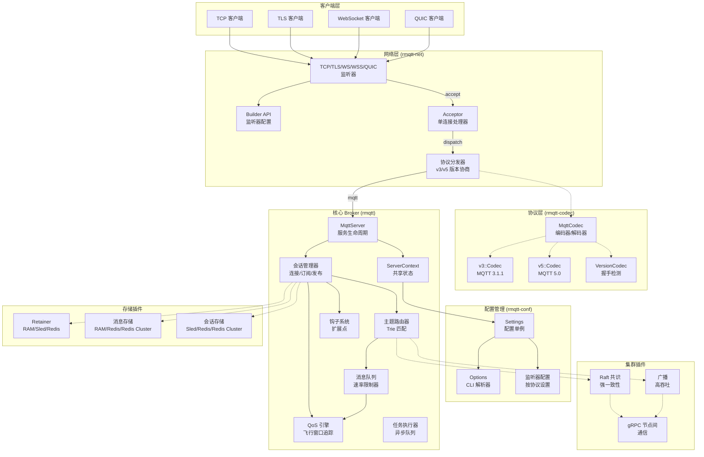

[English](../../en_US/architecture/overview.md) | [**简体中文**](overview.md)

# RMQTT 架构概览

本文档描述了 RMQTT MQTT Broker 的内部架构、组件组织、模块结构和关键设计决策。

---

## 系统架构



---

## Crate 组织

工作区分为以下层级：

### 第一层：基础 Crate

不依赖其他工作区 crate：

| Crate | 路径 | 职责 |
|-------|------|------|
| `rmqtt-utils` | `rmqtt-utils/` | 共享类型（`Bytesize`、`NodeAddr`、`Counter`）、serde 辅助、时间戳/间隔解析 |
| `rmqtt-macros` | `rmqtt-macros/` | 过程宏：`#[derive(Metrics)]` 原子计数器、`#[derive(Plugin)]` PackageInfo trait |
| `rmqtt-codec` | `rmqtt-codec/` | MQTT 协议编解码 — v3.1、v3.1.1、v5.0 带版本协商 |

### 第二层：基础设施 Crate

基于基础 crate 构建：

| Crate | 路径 | 依赖 | 职责 |
|-------|------|------|------|
| `rmqtt-net` | `rmqtt-net/` | `rmqtt-codec`、`rmqtt-utils` | 网络层：TCP/TLS/WS/QUIC 监听器、连接接受、协议分发 |
| `rmqtt-conf` | `rmqtt-conf/` | `rmqtt-codec`、`rmqtt-net`、`rmqtt-utils`、`config` | 配置管理：TOML 解析、CLI 参数、监听器配置 |

### 第三层：核心 Broker

| Crate | 路径 | 依赖 | 职责 |
|-------|------|------|------|
| `rmqtt` | `rmqtt/` | 以上所有 + `rmqtt-net`、`rmqtt-codec`、`rmqtt-utils`、`rmqtt-macros`（可选）、`rust-box`、`dashmap`、`tokio` | 核心 MQTT Broker：会话管理、路由、钩子、插件、集群 |

### 第四层：二进制入口

| Crate | 路径 | 职责 |
|-------|------|------|
| `rmqttd` | `rmqtt-bin/` | 生产二进制：CLI 解析 → 配置 → 插件注册 → 服务启动 |
| `mqtt_harness` | `rmqtt-test/` | 测试框架：功能测试、压力测试、混沌测试 |

### 第五层：插件

| Crate | 路径 | 职责 |
|-------|------|------|
| `rmqtt-plugins` | `rmqtt-plugins/` | 元 crate，通过 feature 标志重新导出所有插件 |
| `rmqtt-*` | `rmqtt-plugins/rmqtt-*/` | 25 个独立插件 crate |

---

## 核心模块架构 (rmqtt/src/)

```
rmqtt/src/
├── lib.rs           # Crate 根，重新导出，模块声明
├── server.rs        # MqttServer — 构建器 + 接受循环 + 生命周期
├── context.rs       # ServerContext — 共享状态构建器
├── session.rs       # Session — 客户端状态机 (~2400 行)
├── v3.rs            # MQTT v3.1.1 协议处理器
├── v5.rs            # MQTT v5.0 协议处理器
├── router.rs        # 基于主题的消息路由
├── trie.rs          # 订阅匹配的 Trie 结构
├── topic.rs         # 主题过滤解析和验证
├── fitter.rs        # 主题过滤匹配引擎
├── inflight.rs      # 进行中消息追踪 (QoS 1/2)
├── queue.rs         # 带速率限制的消息队列
├── hook.rs          # 钩子系统 — 10+ 扩展点
├── extend.rs        # 扩展点存储 (10 个 RwLock 插槽)
├── executor.rs      # 异步任务执行器包装
├── types.rs         # 核心数据类型 (~3000 行)
├── node.rs          # 集群节点协调，gRPC 服务
├── acl.rs           # ACL 类型和 trait 定义
├── args.rs          # 命令行参数结构体
├── shared.rs        # 共享订阅 ($share/)
├── delayed.rs       # [feature: delayed] 延迟发布
├── grpc.rs          # [feature: grpc] gRPC 通信
├── message.rs       # [feature: msgstore] 消息存储
├── metrics.rs       # [feature: metrics] 指标收集
├── plugin.rs        # [feature: plugin] Plugin trait + 注册
├── retain.rs        # [feature: retain] 保留消息
├── stats.rs         # [feature: stats] 运行时统计
└── subscribe.rs     # [feature: *-subscription] 订阅辅助
```

---

## 会话生命周期

```mermaid
stateDiagram-v2
    [*] --> Connecting: TCP/TLS/WS 接受连接
    
    state Connecting {
        [*] --> VersionProbe: 读取 CONNECT 包
        VersionProbe --> v3: MQTT 3.1/3.1.1 检测到
        VersionProbe --> v5: MQTT 5.0 检测到
    end
    
    Connecting --> Authenticating: 版本协商完成
    
    state Authenticating {
        [*] --> CheckACL: ClientAuthenticate 钩子
        CheckACL --> Allowed: 规则匹配
        CheckACL --> Denied: 无规则或拒绝
    end
    
    Authenticating --> Connected: CONNACK 已发送
    Authenticating --> [*]: CONNACK 拒绝
    
    state Connected {
        [*] --> Subscribing: 收到 SUBSCRIBE
        Subscribing --> Active: SUBACK 已发送
        
        Active --> Publishing: 收到 PUBLISH
        Publishing --> Active: PUBACK 或 PUBREC
        
        Active --> Receiving: 从路由器收到消息
        Receiving --> Active: 已发送给客户端
        
        Active --> Idle: 无活动
        Idle --> Active: PINGREQ PINGRESP
    end
    
    Connected --> Disconnecting: 收到 DISCONNECT
    Connected --> Disconnecting: 保活超时
    Connected --> Disconnecting: 客户端断开
    
    Disconnecting --> Cleanup: 过期保存会话
    Cleanup --> [*]: 会话终止
```

---

## 关键设计决策

### 1. 零不安全代码

全项目强制 `#![deny(unsafe_code)]`。所有并发通过安全抽象（`tokio::sync`、`DashMap`、`Arc`）处理。

### 2. 锁策略

- **热路径**：`DashMap`（无锁并发 HashMap）用于订阅 Trie 和会话查找
- **异步上下文**：`tokio::sync::RwLock` 用于配置和共享状态（绝不在异步代码中使用 `std::sync::RwLock`）
- **细粒度**：`std::sync::Mutex` 仅用于小型同步临界区

### 3. 生产环境无 Panic

- `unwrap()` / `expect()` 仅出现在测试代码中
- 所有 `Result` 和 `Option` 通过 `?` 或模式匹配处理
- 生产路径中无 `panic!` / `todo!` / `unreachable!`

### 4. 插件隔离

每个插件是独立的 crate，可选编译。元 crate（`rmqtt-plugins`）通过 feature 标志重新导出所有插件，确保未使用的功能零开销。

### 5. 编解码架构

MQTT 编解码使用状态机模式：
1. `VersionCodec` 从 CONNECT 数据包检测协议版本
2. 切换到 `v3::Codec` 或 `v5::Codec` 处理后续会话
3. 两者都实现 `tokio_util::codec::Encoder/Decoder` 以支持异步流

---

## Feature 标志

核心 Broker（`rmqtt`）使用 Cargo feature 标志条件编译可选功能：

| Feature | 启用内容 | 关键依赖 |
|---------|----------|----------|
| `default` | 最小构建（无额外功能） | — |
| `metrics` | 指标收集 | `rmqtt-macros/metrics` |
| `stats` | 运行时统计 | — |
| `plugin` | 插件系统 | `rmqtt-macros/plugin` |
| `grpc` | 节点间 gRPC | `rust-box/handy-grpc`、`msgstore` |
| `tls` | TLS 传输 | `rmqtt-net/tls` |
| `ws` | WebSocket 传输 | `rmqtt-net/ws` |
| `quic` | QUIC 传输 | `rmqtt-net/quic` |
| `delayed` | 延迟发布 | — |
| `retain` | 保留消息 | — |
| `msgstore` | 消息存储 | — |
| `shared-subscription` | `$share/` 组 | — |
| `auto-subscription` | 自动订阅 | — |
| `limit-subscription` | 订阅限制 | — |
| `full` | 以上所有 | — |

## 许可证

MIT OR Apache-2.0
