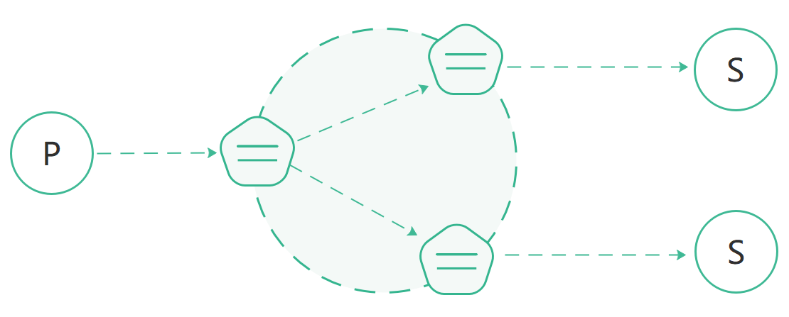
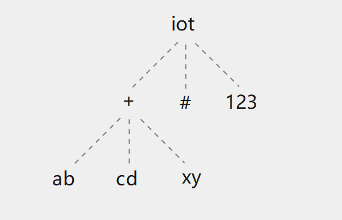

[English](../en_US/cluster-raft.md)  | 简体中文

# 基于RAFT共识算法的集群

*RAFT* 是一种分布式共识算法，用于在多个节点之间达成一致性，确保分布式系统在某些节点故障时仍能正常运行，用于实现可靠的数据存储和一致性服务。


### 工作原理

*RMQTT* 的集群是通过 *rmqtt-cluster-raft* 插件实现的。集群中的每个节点都运行一个 *RMQTT* 实例，每个节点与集群中的其他节点通信，共享
客户端连接状态、订阅关系等信息。这允许集群在节点之间自动分配负载并在节点出现故障时提供高可用性。

*RMQTT* 集群在不同节点上维护数据的多个副本来提供数据冗余，即使一部份节点发生故障，数据在集群中的其他节点上仍然可用。

在集群架构下，您可以随着业务的增长向集群添加新节点，从而提供可扩展性。这使您可以处理越来越多的客户端和消息，而不必担心单个代理的限制。

### *RMQTT* 分布式集群设计

*RMQTT* 分布式集群的基本功能是转发和发布消息到订阅者，如下图所示。



*RMQTT* 集群主要维护以下几个数据结构：

- 主题树
- 订阅关系

### 主题树
主题树是一种分层数据结构，它存储有关主题层次结构的信息，并用于消息与订阅客户端的匹配。

主题树会在集群中的所有节点复制一份，下面是一个 *主题树* 的例子:

| Client | Node | Subscribed topic   |
| ---- | --------- |--------------------|
| client1 | node1    | iot/+/ab, iot/+/cd |
| client2 | node2    | iot/#              |
| client3 | node3    | iot/+/xy, iot/123  |



### 订阅关系：主题-订阅者

*RMQTT* 会维护一个订阅关系表，用于存储主题->订阅者之间的映射关系，从而确保能将传入消息正确路由到对应的客户端。订阅关系会在集群中的所有节点复制一份，
类似的结构如下：

```bash
    topic1 -> client1(node1), client2(node2)
    topic2 -> client3(node3)
    topic2 -> client4(node4)
```

### 消息分发流程

当一个 MQTT 客户端发布消息时，它所在的节点会根据消息主题查找主题树并获取匹配的订阅主题过滤器，然后通过订阅关系表查询所有订阅者及所在节点并将消息
转发到对应的节点。

然后，接收到消息的节点会将消息发送至对应的订阅者。

例如，当客户端 1 发布一条消息到主题 iot/123 时，消息在节点之间的路由和分发如下:

1. 客户端 1 向节点 1 发布一条主题为 iot/123  的消息；
2. 节点 1 查询主题树，匹配到 iot/123 和 iot/# 主题过滤器。
3. 节点 1 查询订阅关系表，并得知：
   - 节点 2 上有客户端(client2)订阅了 iot/# 主题；
   - 节点 3 上有客户端(client3)订阅了 iot/123 主题；因此节点 1 会将消息同时转发给节点 2 和节点 3。
4. 节点 2 收到转发的 iot/123 消息后，将消息转发给client2客户端。
5. 节点 3 收到转发的 iot/123 消息后，将消息转发给client3客户端。
6. 消息发布完成。


### 插件：

```bash
rmqtt-cluster-raft
```

#### 插件配置文件：

```bash
plugins/rmqtt-cluster-raft.toml
```

#### 插件配置项：
```bash
##--------------------------------------------------------------------
## rmqtt-cluster-raft
##--------------------------------------------------------------------

#cluster raft worker threads
worker_threads = 6

#grpc message type
message_type = 198
# The list of gRPC addresses for the nodes in the cluster.
# Each entry contains the node ID (e.g., 1, 2, 3) followed by the corresponding IP address and port.
# These addresses are used for communication between the nodes using gRPC.
node_grpc_addrs = ["1@127.0.0.1:5363", "2@127.0.0.1:5364", "3@127.0.0.1:5365"]
#Maximum number of messages sent in batch
node_grpc_batch_size = 128
##Client concurrent request limit
node_grpc_client_concurrency_limit = 128
##Connect and send to server timeout
node_grpc_client_timeout = "60s"

# The list of Raft peer addresses for the nodes in the cluster.
# Each entry contains the node ID and the corresponding IP address and port for Raft consensus communication.
# These addresses are used by the Raft protocol to maintain consistency and coordination across the nodes.
raft_peer_addrs = ["1@127.0.0.1:6003", "2@127.0.0.1:6004", "3@127.0.0.1:6005"]

#Raft cluster listening address
#If this listening address is not specified, the address of the node corresponding to `raft_peer_addrs` will be used.
#laddr = "0.0.0.0:6003"

#Specify a leader id, when the value is 0 or not specified, the first node
#will be designated as the Leader. Default value: 0
leader_id = 0

#Handshake lock timeout
try_lock_timeout = "10s"
task_exec_queue_workers = 500
task_exec_queue_max = 100_000

#algorithm used to compress the snapshot, value: zstd,lz4,zlib,snappy
compression = "zstd"

#Check the health of the node, and automatically terminate the program if the node is abnormal.
#Default value: false
health.exit_on_node_unavailable = false
#Exit code on program termination.
#Default value: -1
health.exit_code = -1
#When exit_on_node_unavailable is enabled, the program will terminate after a specified number of consecutive node failures.
#Default value: 2
health.max_continuous_unavailable_count = 2
#Cluster node unavailability check interval.
#Default value: 2 seconds
health.unavailable_check_interval = "2s"

raft.grpc_timeout = "6s"
raft.grpc_concurrency_limit = 200
raft.grpc_breaker_threshold = 5
raft.grpc_breaker_retry_interval = "2500ms"
raft.proposal_batch_size = 60
raft.proposal_batch_timeout = "200ms"
raft.snapshot_interval = "600s"
raft.heartbeat = "100ms"

raft.election_tick = 10
raft.heartbeat_tick = 5
raft.max_size_per_msg = 0
raft.max_inflight_msgs = 256
raft.check_quorum = true
raft.pre_vote = true
raft.min_election_tick = 0
raft.max_election_tick = 0
raft.read_only_option = "Safe"
raft.skip_bcast_commit = false
raft.batch_append = false
raft.priority = 0

```

- 'node_grpc_addrs' 主要用于Publish消息转发，'raft_peer_addrs'用于raft集群消息的同步。

- 'laddr' 用于指定Raft监听地址，如果不指定，将默认使用'raft_peer_addrs'中配置的地址。

- 'leader_id' 指定一个 leader ID，当值为 0 或未指定时，默认为第一个启动的节点。

- 'compression' 指定一种用于压缩快照的算法，取值：zstd、lz4、zlib、snappy。不设置将不会进行压缩。

- 'health' 可配置当节点不可用时的行为，当前只有两种处理方式：
    - 一是忽略（默认），不做任何处理。
    - 二是退出程序，用以方便在这个节点上的所有客户端连接通过LB等负载均衡设备重连到其它正常节点。负载均衡设备有必要配置健康检查以便及时通知运维人员。


默认情况下并没有启动此插件，如果要开启此插件，必须在主配置文件“rmqtt.toml”中的“plugins.default_startups”配置中添加“rmqtt-cluster-raft”项，如：
```bash
##--------------------------------------------------------------------
## Plugins
##--------------------------------------------------------------------
#Plug in configuration file directory
plugins.dir = "rmqtt-plugins/"
#Plug in started by default, when the mqtt server is started
plugins.default_startups = [
    #"rmqtt-plugin-template",
    #"rmqtt-retainer",
    #"rmqtt-auth-http",
    #"rmqtt-cluster-broadcast",
    "rmqtt-cluster-raft",
    #"rmqtt-sys-topic",
    #"rmqtt-message-storage",
    #"rmqtt-session-storage",
    #"rmqtt-bridge-ingress-mqtt",
    #"rmqtt-bridge-egress-mqtt",
    #"rmqtt-bridge-ingress-kafka",
    #"rmqtt-bridge-egress-kafka",
    #"rmqtt-bridge-egress-pulsar",
#    "rmqtt-bridge-ingress-pulsar",
    "rmqtt-web-hook",
    "rmqtt-http-api"
]
```