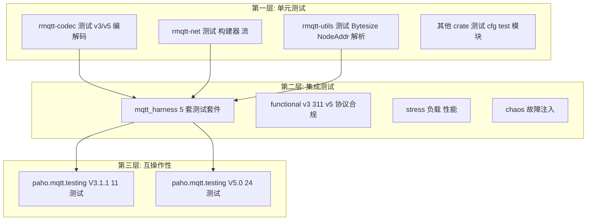

[English](../../en_US/development/testing.md) | [**简体中文**](testing.md)

# RMQTT 测试指南

本文档描述了 RMQTT 的测试策略、测试层次以及如何运行和扩展测试套件。

---

## 测试层次



---

## 第一层：单元测试

```bash
# 运行所有单元测试
cargo test

# 特定 crate
cargo test -p rmqtt-codec

# 匹配名称模式
cargo test -p rmqtt-codec -- qos
```

每个 crate 包含 `#[cfg(test)]` 模块。关键测试文件分布在各 crate 的 `src/` 目录中。

---

## 第二层：集成测试框架

`rmqtt-test` crate 提供名为 `mqtt_harness` 的独立测试二进制文件。

### 构建和运行

```bash
cargo build --release
cargo build -p rmqtt-test --release

# 运行所有套件（自动启动 Broker）
./target/release/mqtt_harness --workspace .

# 运行特定套件
./target/release/mqtt_harness --workspace . --suites functional_v5

# 连接到已运行的 Broker
./target/release/mqtt_harness --no-broker

# 生成报告
./target/release/mqtt_harness --workspace . --json report.json --html report.html
```

### 测试套件参考

| 套件 | 用例数 | 测试内容 |
|-------|--------|----------|
| `functional_v3` | 2 | MQTT 3.1 连接/断开、QoS 0 发布/订阅 |
| `functional_v311` | 10 | MQTT 3.1.1 协议合规（连接、QoS 0/1/2、保留、通配符、取消订阅） |
| `functional_v5` | 5 | MQTT 5.0 协议合规（连接、Reason Code、QoS 0/1/2） |
| `stress` | 3 | 连接负载（100 客户端）、发布 QPS（1000 条）、扇出（1→N） |
| `chaos` | 6 | Broker 重启、连接抖动、重连风暴、QoS 1 可靠性、慢消费者 |

---

## 第三层：互操作性测试

RMQTT 通过了 [paho.mqtt.testing](https://github.com/eclipse/paho.mqtt.testing) 套件：

```bash
git clone https://github.com/eclipse/paho.mqtt.testing.git
cd paho.mqtt.testing/interoperability

# MQTT v3.1.1：11/11 通过
python client_test.py

# MQTT v5.0：24/24 通过
python client_test5.py
```

---

## 编写新测试

### 添加单元测试

```rust
#[cfg(test)]
mod tests {
    use super::*;

    #[test]
    fn test_my_feature() {
        let result = my_function();
        assert_eq!(result, expected_value);
    }

    #[tokio::test]
    async fn test_async_feature() {
        let result = my_async_function().await;
        assert!(result.is_ok());
    }
}
```

### 添加集成测试用例

实现 `TestCase` trait 并在测试入口注册。详情见 [rmqtt-test](../../../rmqtt-test/README-CN.md)。

---

## 性能基准测试

```bash
# 连接负载测试
./target/release/mqtt_harness --no-broker --suites stress \
  --stress-clients 10000
```

详细的基准测试结果见 [基准测试文档](../benchmark-testing.md)。

---

## 提交前检查清单

```bash
cargo fmt --all && cargo clippy --all-targets && cargo test
```

## 许可证

MIT OR Apache-2.0
