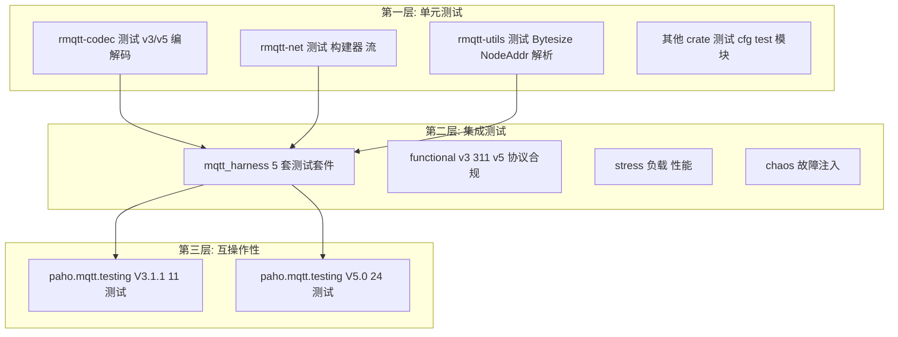

[English](../../en_US/development/testing.md) | [**简体中文**](testing.md)

# RMQTT 测试指南

本文档描述了 RMQTT 的测试策略、测试层次以及如何运行和扩展测试套件。

---

## 测试层次


```mermaid
graph TD
    subgraph L1["第一层: 单元测试"]
        UT1["rmqtt-codec 测试 v3/v5 编解码"]
        UT2["rmqtt-net 测试 构建器 流"]
        UT3["rmqtt-utils 测试 Bytesize NodeAddr 解析"]
        UT4["其他 crate 测试 cfg test 模块"]
    end

    subgraph L2["第二层: 集成测试"]
        IT1["mqtt_harness 5 套测试套件"]
        IT2["functional v3 311 v5 协议合规"]
        IT3["stress 负载 性能"]
        IT4["chaos 故障注入"]
    end

    subgraph L3["第三层: 互操作性"]
        IP1["paho.mqtt.testing V3.1.1 11 测试"]
        IP2["paho.mqtt.testing V5.0 24 测试"]
    end

    UT1 --> IT1
    UT2 --> IT1
    UT3 --> IT1
    IT1 --> IP1
    IT1 --> IP2
```

---

## 第一层：单元测试

```bash
# 运行所有单元测试
cargo test

# 特定 crate
cargo test -p rmqtt-codec

# 匹配名称模式
cargo test -p rmqtt-codec -- qos
```

每个 crate 包含 `#[cfg(test)]` 模块。关键测试文件分布在各 crate 的 `src/` 目录中。

---

## 第二层：集成测试框架

`rmqtt-test` crate 提供名为 `mqtt_harness` 的独立测试二进制文件。

### 构建和运行

```bash
cargo build --release
cargo build -p rmqtt-test --release

# 运行所有套件（自动启动 Broker）
./target/release/mqtt_harness --workspace .

# 运行特定套件（--suites 支持前缀匹配，见下）
./target/release/mqtt_harness --workspace . --suites functional_v5

# 连接到已运行的 Broker
./target/release/mqtt_harness --no-broker

# 生成报告
./target/release/mqtt_harness --workspace . --json report.json --html report.html
```

> **Broker 配置**：默认使用自包含配置 `rmqtt-test/configs/default/rmqtt.toml`
> （不依赖仓库根的 `rmqtt.toml` / `rmqtt-plugins/*.toml`；保留 TCP/TLS/WS/WSS/QUIC
> 全部监听）。需要特殊配置的用例通过 `TestCase::broker_config()` 声明，构建时自动
> 拆分为 `{suite}@{config}` 子套件（如 `functional_v5@retain-disabled`），调度器仅在
> **suite 边界**重启 broker 切换配置。可显式指定配置：
>
> ```bash
> ./target/release/mqtt_harness --workspace . --config rmqtt-test/configs/retain-disabled/rmqtt.toml
> ./target/release/mqtt_harness --workspace . --suites functional_v5@retain-disabled
> ```

### 测试套件参考

| 套件 | 用例数 | 测试内容 |
|-------|--------|----------|
| `functional_v3` | 47 | MQTT 3.1 规范符合性：连接（错误协议名/级别/保留位/空 ClientId/超长 ID）、QoS 0/1/2 发布/订阅、QoS 2 去重与 PUBREL 重发、保留消息、遗嘱、Keep Alive、会话持久化、通配符（含 `$SYS`）、边界载荷、协议错误 |
| `functional_v311` | 64 | MQTT 3.1.1 规范符合性：连接（含二次 CONNECT 拒绝 [MQTT-3.1.0-2]）、QoS 0/1/2、保留消息边界、Will QoS2、Keep Alive 1.5 倍超时、Session Present/恢复、通配符匹配、共享订阅、协议错误 |
| `functional_v5` | 63 | MQTT 5.0 规范符合性：CONNACK 能力通告、会话过期（含 DISCONNECT SEI=0 [MQTT-3.14.2-2]）、主题别名（含未知别名→0x94）、流控、最大报文大小、订阅标识符、Retain Handling、Will 延迟、增强认证拒绝（0x8C）、协议错误 |
| `stress` | 3 | 连接负载（100 客户端）、发布 QPS（1000 条）、扇出（1→N） |
| `chaos` | 6 | Broker 重启、连接抖动、重连风暴、QoS 1 可靠性、慢消费者 |

> functional_v5 的 63 个用例中，`will_retain_rejected_when_retain_unavailable_v5`
> （需不加载 retainer 插件）与 `qos2_pubrel_resume_collision`（需加载
> message-storage 插件）会自动拆分为 `functional_v5@retain-disabled` 与
> `functional_v5@pubrel-collision` 两个子套件，其余 61 个在默认配置组
> `functional_v5` 中运行；配置切换仅发生在 suite 边界。

---

## 第三层：互操作性测试

RMQTT 通过了 [paho.mqtt.testing](https://github.com/eclipse/paho.mqtt.testing) 套件：

```bash
git clone https://github.com/eclipse/paho.mqtt.testing.git
cd paho.mqtt.testing/interoperability

# MQTT v3.1.1：11/11 通过
python client_test.py

# MQTT v5.0：24/24 通过
python client_test5.py
```

---

## 编写新测试

### 添加单元测试

```rust
#[cfg(test)]
mod tests {
    use super::*;

    #[test]
    fn test_my_feature() {
        let result = my_function();
        assert_eq!(result, expected_value);
    }

    #[tokio::test]
    async fn test_async_feature() {
        let result = my_async_function().await;
        assert!(result.is_ok());
    }
}
```

### 添加集成测试用例

实现 `TestCase` trait 并在测试入口注册。详情见 [rmqtt-test](../../../rmqtt-test/README-CN.md)。
需要特殊 broker 配置的用例通过 `broker_config()` 声明，机制说明见
[rmqtt-test 按用例自动切换 Broker 配置](./rmqtt-test-config-switching.md)。

---

## 性能基准测试

```bash
# 连接负载测试
./target/release/mqtt_harness --no-broker --suites stress \
  --stress-clients 10000
```

详细的基准测试结果见 [基准测试文档](../benchmark-testing.md)。

---

## 提交前检查清单

```bash
cargo fmt --all && cargo clippy --all-targets && cargo test
```

## 许可证

MIT OR Apache-2.0
